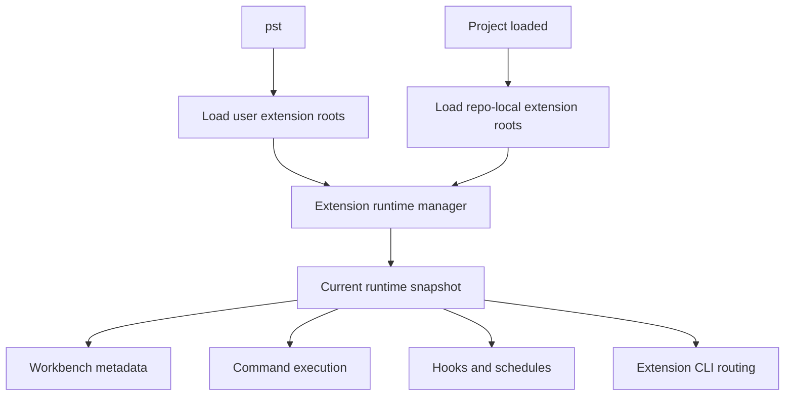
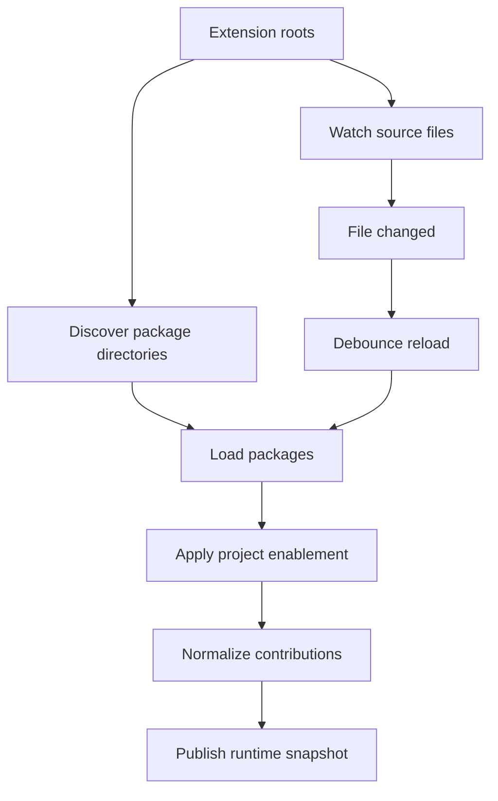
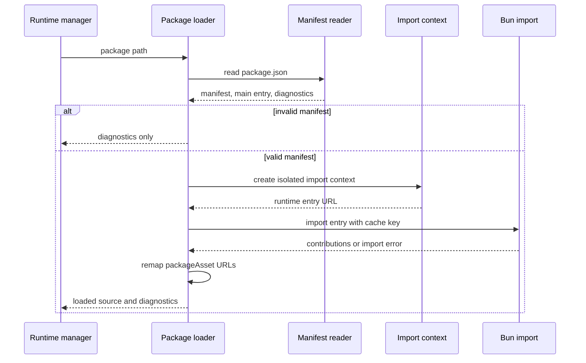
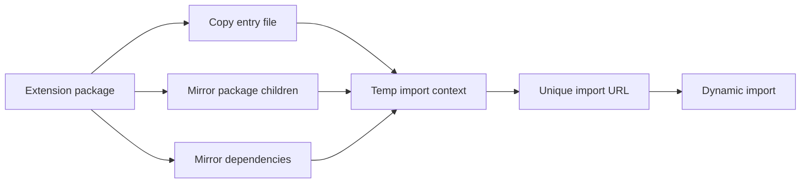
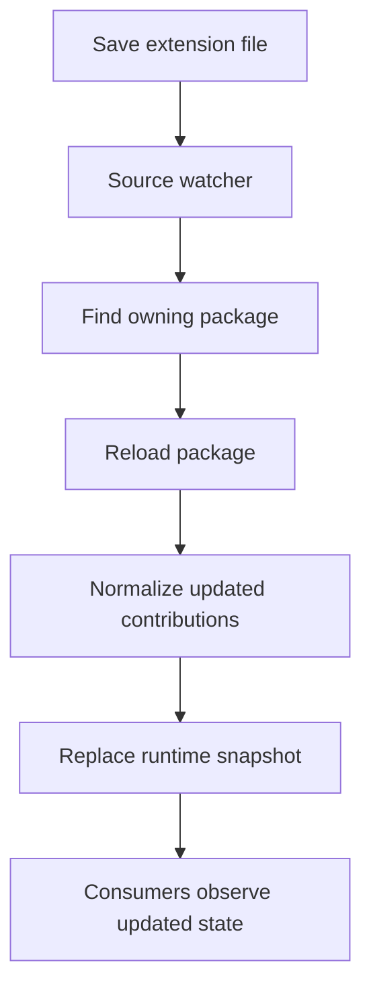
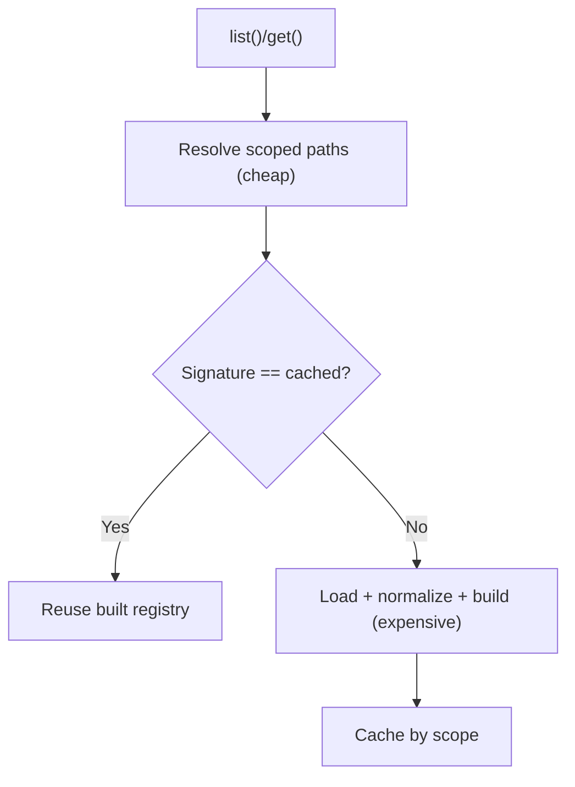
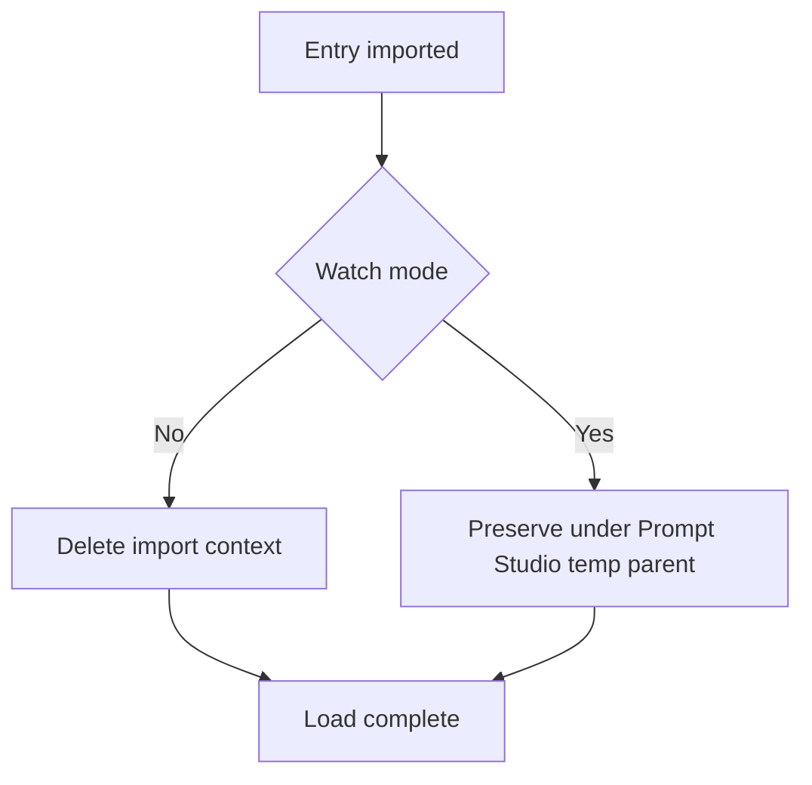

# Extension Runtime

Prompt Studio extensions are local source packages. The extension runtime owns the loaded state for those packages: discovery, validation, import, diagnostics, normalized contributions, and reloads after source changes.

The important boundary is source ownership. Extension code and dependencies belong to the extension package. The host loads the package and records diagnostics, but it must not rewrite the source tree or substitute host-owned dependencies.

This page describes the intended extension runtime architecture. Guest webview execution is separate; webview build output and bridge scripts are handled by the extension webview services.

## Goals

- Load configured extension roots when Prompt Studio starts.
- Load repo-local extension roots when a project is opened.
- Watch extension roots for changes and reload affected sources.
- Keep extension source folders clean during imports and reloads.
- Preserve the extension package's dependency graph. `@pstdio/sdk` is a normal dependency, not a host-provided singleton.
- Keep package metadata and diagnostics visible even when extension code fails to import.
- Give CLI, API, command execution, schedules, hooks, and workbench metadata one current runtime snapshot to read.

## Source Sets

The runtime tracks extension roots only. An extension root is a directory whose immediate child directories are extension packages:

```txt
<extension-root>/
  planner/
    package.json
    extension.ts
  tickets/
    package.json
    extension.ts
```

Examples:

| Source                    | Root                        | When loaded     |
| ------------------------- | --------------------------- | --------------- |
| User installed extensions | `$PSTDIO_HOME/extensions`   | `pst`           |
| Repo-local extensions     | `<repo>/.pstdio/extensions` | project load    |
| Dev or test extensions    | configured extension root   | dev/test launch |

User roots are global to the Prompt Studio process. Repo-local roots are project-scoped. Project enablement filters the loaded packages from those roots; it does not introduce a second package-loading shape.

One-off package validation, such as install-time validation, can use the package loader directly or wrap the package in a temporary root. It is not part of the long-lived watched runtime source set.



## Runtime Manager

The runtime manager owns the lifecycle of loaded extension state.

1. Resolve source sets for the process and active project.
2. Discover packages under each extension root.
3. Load each package into an isolated import context.
4. Filter loaded packages by project enablement where needed.
5. Normalize contributions into runtime records.
6. Store the latest snapshot and diagnostics.
7. Watch the roots for changes.
8. Debounce reloads and replace the affected runtime state.

Consumers should not each reload extensions independently. They should read the current snapshot owned by the runtime manager. This keeps extension edits predictable: save a file, the source watcher reloads the affected package, diagnostics and metadata update, and consumers observe the new snapshot.

## Lifecycle Ownership

Extension lifecycle commands have one API coordinator. Install, enable, disable, automation changes, and uninstall commit their database changes before they return. The response is the authoritative result of that transition.

Lifecycle handlers must not rely on a later list request to finish a transition. List endpoints are read-only. Discovery and reconciliation run during startup, project loading, repo linking, or an explicit reload command.

After a commit, the coordinator performs only work required for the response to be usable. For example, it waits for workspace provisioning when an enabled extension contributes skills or workspace hooks. Watcher refreshes and unrelated metadata reconciliation may continue after the response.

Extension instance events contain the full project scope for both set and delete operations. Runtime invalidation can therefore target only the affected project.

The dashboard applies a successful lifecycle response to its cache before starting background refetches. It cancels older list and metadata reads first, so a request that started before the mutation cannot restore stale state. Sync events subscribe once at the project extension boundary and invalidate that same cache.



## Package Load Flow

The package loader is a primitive used by the runtime manager. It loads one package and returns either a loaded source or diagnostics.

The loader reads `package.json` before importing code. This lets Prompt Studio keep package identity visible even when `extension.ts` is broken.



## Import Context

The loader imports the extension entry from a temporary runtime package instead of importing the source entry directly.

The import context exists to satisfy three constraints:

- Fresh imports: Bun caches modules by import URL, so each reload needs a unique import URL.
- Source cleanliness: cache-busting files must not be written into the extension source package.
- Package context: relative imports, package assets, and package-local dependencies must resolve as if the entry was loaded from the extension package.

The runtime package should live under a dedicated Prompt Studio temp parent, not scattered directly in the temp root:

```txt
<tmp>/pstdio/runtime-imports/<process-id>/<import-id>/
  package/
    package.json
    extension.ts
    src/
    templates/
    skills/
    node_modules/
```

The entry file is copied to produce a unique import target. Package children and dependencies are mirrored or symlinked so imports and package assets still resolve through the extension package's dependency graph.

`@pstdio/sdk` is not special. If an extension imports it, the extension package should declare and install it like any other dependency. During local development, use the package manager to link or symlink the workspace SDK into the extension package when the extension needs unpublished SDK changes.

Installed user/global extensions must be self-contained at the installed package root. Do not validate
or ship them with `--skip-install`, and do not leave `node_modules` symlinked back to a workspace
checkout. The runtime intentionally preserves the extension package's dependency graph; it will not
rewrite a broken install into a different dependency layout.



## Reloads After Edits

Editing an extension file should not require every consumer to rediscover extensions. The source watcher should observe the changed file and reload the affected package through the runtime manager.



Reloads are debounced. A package save can touch multiple files, and dependency installs can update many files. The runtime manager should collapse those events into one reload per affected source.

## Harness Registry Caching

Harnesses (agents) are resolved through the harness registry, which loads and normalizes the scoped set of extension sources into harness handles. Building that registry re-reads and re-imports every extension package, so it must not run on every request — `list()`/`get()` are called on hot paths (session create, stream, agent polling).

The registry service caches the built registry per scope (host-wide vs a specific project), keyed by a cheap **path-set signature**: the sorted set of scoped source paths plus a generation counter. The signature does not read file contents, so it is cheap to recompute on every call.



Invalidation is driven by two signals:

- **Path-set changes** (install, enable, disable, uninstall) change the scoped paths, so the signature changes and the registry rebuilds automatically.
- **In-place source reloads** (the source watcher reloading edited files) keep the same paths, so the source-change notification calls `invalidate()`, which bumps the generation counter and forces a rebuild on the next call.

`detect()` shells out to the harness CLI (`<cli> --version`) to report availability. The service memoizes each handle's `detect()` result for a short TTL so a burst of availability polls probes each harness once per window instead of once per request. The memo lives on the cached registry, so it is dropped whenever the registry rebuilds.

## Cleanup And Watch Mode

In normal execution, the temp import context can be deleted after the import completes. In a long-running watched development server, deleting a dynamically imported temp file can itself trigger `bun --watch` to restart the API. That caused restart loops.

Watch-mode development should preserve import contexts that Bun may be watching, but under a dedicated Prompt Studio temp parent so they can be cleaned intentionally on startup, shutdown, or process rollover.



Production entrypoints do not use `bun --watch`. Published installs run a platform binary through `bin/pstdio.cjs`,
and compiled auto-start self-spawns that binary in foreground-sidecar mode. Workspace non-dev auto-start invokes the
same combined runtime from `packages/pstdio`; both publish the shared runtime descriptor after authenticated readiness.

## Extension process environment

Extension commands and terminals start from an allowlisted host environment instead of inheriting the API process
environment. The inherited keys are `BUN_INSTALL`, `BUN_INSTALL_CACHE_DIR`, `COLORTERM`,
`ComSpec`, `FORCE_COLOR`, `HOME`, `LANG`, `LOGNAME`, `NO_COLOR`, `PATH`, `PATHEXT`, `SHELL`, `SystemRoot`, `TEMP`,
`TERM`, `TMP`, `TMPDIR`, `TZ`, `USER`, `USERPROFILE`, `VOLTA_HOME`, `WINDIR`, and locale variables beginning with
`LC_`. Explicit environment values supplied by the runtime contract are then added and may override an inherited
value.

Dependency installers use the same base environment plus a separate package-network allowlist. It includes standard
upper- and lower-case proxy variables, Bun and npm registry settings, common registry tokens, npm configuration file
paths, and CA certificate paths. Those values are available only to `bun install`; extension commands and terminals
do not inherit them.

Host credentials such as `PSTDIO_API_TOKEN`, provider API keys, GitHub tokens, SSH agent sockets, and `NODE_OPTIONS`
are therefore absent unless the calling runtime explicitly grants them. Extensions that need a credential must
declare and receive it through their supported configuration path rather than relying on ambient process state.

## What The Runtime Does Not Own

- Extension webview one-shot bundling. Owned by `packages/pstdio-api/src/features/extensions/extension-webview-build-manager.ts`; the author-facing contract is covered by [Extension API](../extensions/api.md), [Dashboard UI attachments](../extensions/workbench-attachments.md), and [Extension cookbook](../extensions/cookbook.md).
- Serving webview assets to the dashboard. The extension-owned access service issues process-lived capability URLs,
  and the separate asset route realm authorizes and serves managed build output without entering normal session
  middleware. See [ADR 0008](../adrs/0008-capability-secured-extension-webview-assets.md). Dashboard placement and
  webview contribution behavior are documented in [Dashboard UI attachments](../extensions/workbench-attachments.md).
- Guest webview sandbox execution.
- Extension command process spawning from inside a command handler.
- Project settings storage and extension enablement persistence.

Those layers consume the runtime snapshot and diagnostics.

## Key Files

- `packages/pstdio-extensions/src/runtime/loader.ts`: package import primitive.
- `packages/pstdio-extensions/src/runtime/runtime.ts`: runtime loading entrypoint.
- `packages/pstdio-extensions/src/runtime/check.ts`: extension validation output.
- `packages/pstdio-api/src/features/extensions/extension-command-runtime.ts`: command runtime consumption.
- `packages/pstdio-api/src/features/extensions/extension-runtime.ts`: source reload and metadata consumption.
- `packages/pstdio-api/src/features/harnesses/harness-registry-service.ts`: scoped harness registry caching, invalidation, and `detect()` memoization.
- `packages/pstdio/src/adapters/cli/dashboard/api.ts`: production and workspace API start paths.
