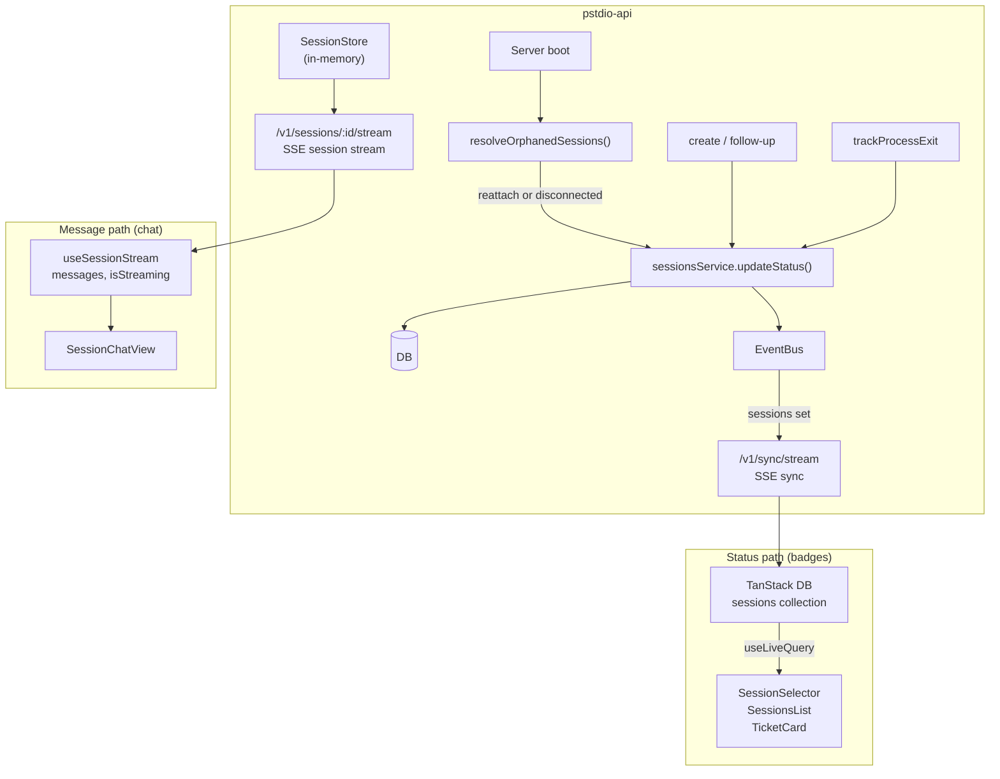

# Session Status Lifecycle

Session status has one authoritative path: DB → SSE sync → UI badges. The session stream is a separate concern that only carries messages.

## Architecture



### Status path — DB sync (badges)

Every session badge in the UI reads from the synced sessions collection:

1. Server mutates `sessions` table via `sessionsService.updateStatus()`.
2. Server emits `eventBus.emit("sessions", "set", record)`.
3. SSE sync stream delivers `sync:set` event to all connected clients.
4. Client `sync-client.ts` writes to the TanStack DB `sessions` collection.
5. `useLiveQuery` re-renders badge components with the new status.

Components on this path: `TicketCard`, `SessionSelector`, `SessionsList`.

### Message path — session stream (chat)

The session chat view reads messages from a per-session SSE stream:

1. Client opens `EventSource` to `/v1/sessions/:id/stream`.
2. Server sends `patch` events (JSON patches for messages) and `approval_request` events.
3. `useSessionStream` hook maintains local state for messages and streaming indicator.

Components on this path: `SessionChatView` (messages and streaming indicator only).

`useSessionStream` does not expose session status. All visible status badges come from the DB sync path.

## Status transitions

```
create / follow-up ──► in_progress
                           │
              ┌────────────┼────────────┬────────────┬────────────┐
              ▼            ▼            ▼            ▼            ▼
       awaiting_input  completed     failed      cancelled   disconnected
              │                                                    │
              ▼                                                    ▼
        in_progress (on approval)                         in_progress (on follow-up)
```

`disconnected` means the server lost the live process handle (timeout or restart) and could not reattach. The agent session still exists on the provider side; a follow-up sent by the user spawns a fresh resume and transitions the session back to `in_progress`.

### Who writes status

| Trigger                | New status             | Code location                             |
| ---------------------- | ---------------------- | ----------------------------------------- |
| Session created        | `in_progress`          | `sessionsService.create()`                |
| Follow-up sent         | `in_progress`          | `followUpSessionHandler`                  |
| Approval granted       | `in_progress`          | `approveSessionHandler`                   |
| Process exit code 0    | `completed`            | `trackProcessExit`                        |
| Process exit code != 0 | `failed`               | `trackProcessExit`                        |
| Process activity timeout | `disconnected`       | `trackProcessExit`                        |
| User stop              | `cancelled`            | `stopSessionHandler`                      |
| Stale recovery (reattach) | stays `in_progress` | `resolveOrphanedSessions` (startup sweep) |
| Stale recovery (no reattach) | `disconnected`   | `resolveOrphanedSessions` (startup sweep) |

### Multi-path status updates

Session status can change through multiple paths, but each transition must run one shared side-effect contract:

1. Persist the new status in `sessions` (`sessionsService.updateStatus`).
2. Emit sync event (`eventBus.emit("sessions", "set", updated)`).
3. Fire the session lifecycle hook for that transition when `project_id` exists:
   - `fireSessionStatusHook` for status hooks (`completed`, `failed`, `awaiting_input`)
   - `fireSessionResumeHook` for resume transitions back to `in_progress`

Current paths that must follow this contract:

- `PATCH /v1/sessions/:id/status` (`updateSessionStatusHandler`)
- Agent process exit (`trackProcessExit`)
- Startup orphan recovery (`resolveOrphanedSessions`)
- Session create spawn failure fallback (`createSessionHandler` catch path)
- Session follow-up transition to `in_progress` (`followUpSessionHandler`)
- Approval transition `awaiting_input -> in_progress` (`approveSessionHandler`)
- Ticket attempt spawn failure fallback (`failStartedSession` in `create-ticket-attempt.utils.ts`)

## Stale status recovery

### The problem

Event stores and process handles are **ephemeral** — they live in the `SessionStore` (an in-memory `Map`). When the server restarts:

1. All `SessionStore` entries are lost.
2. `trackProcessExit` callbacks never fire for sessions that were running.
3. The DB retains `in_progress` for sessions whose agents already finished.
4. Badges on tickets stay stuck at `in_progress` permanently.

### The fix — startup sweep

On server boot, `resolveOrphanedSessions` runs as a startup task:

```
Server starts
     │
     ▼
Query all sessions with status "in_progress"
     │
     ▼
For each session:
  SessionStore has entry? ──yes──► Skip (legitimately running)
     │
     no (process handle lost)
     │
     ▼
  Agent advertises SessionReattach
  and session has agent_session_id?
     │
     ├── yes ──► agent.reattachSession() → re-subscribe to the agent's
     │            message stream; session stays "in_progress" and
     │            transitions naturally via trackProcessLifecycle.
     │
     └── no / reattach throws ──► "disconnected"
```

Reattach is agent-specific. OpenCode supports it: the opencode server is a long-lived process holding the canonical message history, so the pstdio server can re-poll `getSessionMessages` and exit the poll loop when the trailing assistant message has `info.time.completed` set. Claude Code does not — the child process dies with the pstdio server and there is nothing to reattach to.

A session in `disconnected` is not a dead end. The agent session still exists on the provider; a user follow-up spawns a fresh `resumeSession` and returns the session to `in_progress`.

### Structure

```
packages/pstdio-api/src/
  startup/
    index.ts              ← runStartupTasks(deps) — single entry point
  features/
    sessions/
      startup.ts          ← resolveOrphanedSessions(deps)
  app.ts                  ← calls runStartupTasks after deps are assembled
```

Each feature owns its startup logic. `createApp` makes one call. New tasks are one import + one line.

## Rules

1. **Badges always read from DB sync (Path 1).** Never from the session stream hook.
2. **Status writes always go through `sessionsService.updateStatus()` + `eventBus.emit()`.** Both calls are required — the DB update alone is invisible to clients until the next full sync.
3. **Event stores are ephemeral.** Any logic that depends on an active `SessionStore` entry must handle the case where the entry is gone.
4. **Stale recovery runs on startup.** Orphaned `in_progress` sessions are resolved proactively when the server boots, not lazily when a client opens a stream.
5. **Reattach before disconnecting.** If the agent advertises `SessionReattach` and the session has an `agent_session_id`, `resolveOrphanedSessions` re-subscribes to the agent's live state. Only fall back to `disconnected` when reattach is unavailable or fails.
