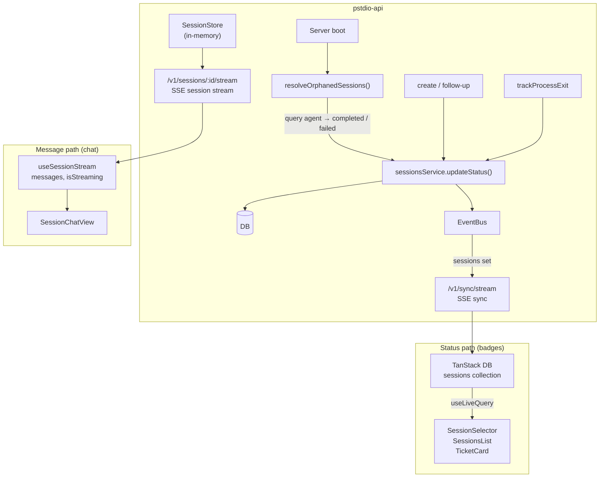

# Session Status Lifecycle

Session status has one authoritative path: DB → SSE sync → UI badges. The session stream is a separate concern that only carries messages.

## Architecture



### Status path — DB sync (badges)

Every session badge in the UI reads from the synced sessions collection:

1. Server mutates `sessions` table via `sessionsService.updateStatus()`.
2. Server emits `eventBus.emit("sessions", "set", record)`.
3. SSE sync stream delivers `sync:set` event to all connected clients.
4. Client `sync-client.ts` writes to the TanStack DB `sessions` collection.
5. `useLiveQuery` re-renders badge components with the new status.

Components on this path: `TicketCard`, `SessionSelector`, `SessionsList`.

### Message path — session stream (chat)

The session chat view reads messages from a per-session SSE stream:

1. Client opens `EventSource` to `/v1/sessions/:id/stream`.
2. Server sends `patch` events (JSON patches for messages) and `approval_request` events.
3. `useSessionStream` hook maintains local state for messages and streaming indicator.

Components on this path: `SessionChatView` (messages and streaming indicator only).

`useSessionStream` does not expose session status. All visible status badges come from the DB sync path.

## Status transitions

```
create / follow-up ──► in_progress
                           │
              ┌────────────┼────────────┬────────────┐
              ▼            ▼            ▼            ▼
       awaiting_input  completed     failed      cancelled
              │
              ▼
        in_progress (on approval)
```

### Who writes status

| Trigger                | New status             | Code location                             |
| ---------------------- | ---------------------- | ----------------------------------------- |
| Session created        | `in_progress`          | `sessionsService.create()`                |
| Follow-up sent         | `in_progress`          | `followUpSessionHandler`                  |
| Approval granted       | `in_progress`          | `approveSessionHandler`                   |
| Process exit code 0    | `completed`            | `trackProcessExit`                        |
| Process exit code != 0 | `failed`               | `trackProcessExit`                        |
| User stop              | `cancelled`            | `stopSessionHandler`                      |
| Stale recovery         | `completed` / `failed` | `resolveOrphanedSessions` (startup sweep) |

## Stale status recovery

### The problem

Event stores and process handles are **ephemeral** — they live in the `SessionStore` (an in-memory `Map`). When the server restarts:

1. All `SessionStore` entries are lost.
2. `trackProcessExit` callbacks never fire for sessions that were running.
3. The DB retains `in_progress` for sessions whose agents already finished.
4. Badges on tickets stay stuck at `in_progress` permanently.

### The fix — startup sweep

On server boot, `resolveOrphanedSessions` runs as a startup task:

```
Server starts
     │
     ▼
Query all sessions with status "in_progress"
     │
     ▼
For each session:
  SessionStore has entry? ──yes──► Skip (legitimately running)
     │
     no (process handle lost)
     │
     ▼
  Query agent: agent.getMessages(agent_session_id)
     │
     ├── has messages ──► "completed"
     └── no messages / unreachable ──► "failed"
     │
     ▼
  Update DB + emit sync event
```

The agent is the external source of truth that survives server restarts. If it has messages, the session completed. If not (or if unreachable), it failed.

### Structure

```
packages/pstdio-api/src/
  startup/
    index.ts              ← runStartupTasks(deps) — single entry point
  features/
    sessions/
      startup.ts          ← resolveOrphanedSessions(deps)
  app.ts                  ← calls runStartupTasks after deps are assembled
```

Each feature owns its startup logic. `createApp` makes one call. New tasks are one import + one line.

## Rules

1. **Badges always read from DB sync (Path 1).** Never from the session stream hook.
2. **Status writes always go through `sessionsService.updateStatus()` + `eventBus.emit()`.** Both calls are required — the DB update alone is invisible to clients until the next full sync.
3. **Event stores are ephemeral.** Any logic that depends on an active `SessionStore` entry must handle the case where the entry is gone.
4. **Stale recovery runs on startup.** Orphaned `in_progress` sessions are resolved proactively when the server boots, not lazily when a client opens a stream.
5. **The agent is the recovery authority.** When local state is lost, query the agent to determine the session outcome.
