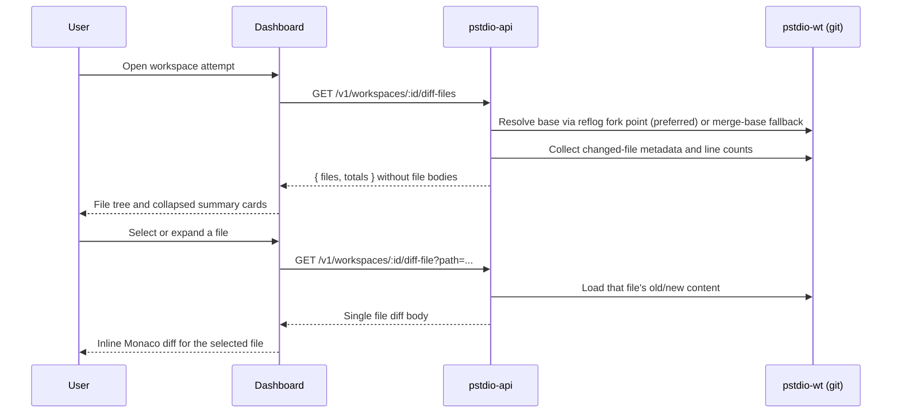

# Workspace Diff Presentation

How Prompt Studio presents workspace diffs to users in the dashboard.

## Scope

Covers the workspace screen and diff summary badges:

- Route: `/projects/:projectId/tickets/:ticketShorthand/workspaces/:workspaceShorthand`
- Diff source: `GET /v1/workspaces/:id/diff-files` plus on-demand `GET /v1/workspaces/:id/diff-file`
- Renderer: right-side workspace diff panel

## Where Users See Diffs

### 1) Ticket board cards (summary only)

Each ticket card resolves its latest attempt and shows addition/deletion totals inside the workspace badge. Clicking the workspace badge opens the workspace page for that attempt.

### 2) Ticket details header button (summary only)

Shows attempt count and latest diff totals. Clicking opens the latest workspace when attempts exist.

### 3) Workspace page right panel (`Changes` + `Checks`)

The selected attempt is resolved from route params. The main panel has two tabs in this fixed order:

- `Changes` — file-by-file diff tree and diff drawer
- `Checks` — ticket artifact list and artifact content viewer

Tab state is URL-backed (`?tab=changes|checks`) and preserved alongside workspace session search state.

## End-to-End Flow

## Backend Diff Generation

### Endpoint

The workspace page uses metadata-first endpoints in `pstdio-api`:

- `GET /v1/workspaces/:id/diff-files` — changed-file metadata, counts, and totals without file bodies
- `GET /v1/workspaces/:id/diff-file?path=...` — old/new content for one requested file

`GET /v1/workspaces/:id/diff` remains available when callers need the complete diff response in one request.

### Validation

1. Resolve workspace by id
2. Require worktree path
3. Require and resolve associated repository

Returns typed errors (400/404) on failure.

### Diff Calculation

Handled by `pstdio-wt`:

1. **Resolve base commit** (`resolve-base.ts`): prefer the reflog fork point (the commit the worktree branch was created from), falling back to `merge-base HEAD main/master`, then the repo root commit.
2. **Discover changed files**: union of `git diff --name-status <base> HEAD` (committed), `git diff --name-status HEAD` (uncommitted), and `git ls-files --others --exclude-standard` (untracked).
3. **Full diff**: fetch old/new content and numstat per file. **Summary**: aggregate numstat totals without reading file content.

The user sees everything the attempt changed since the branch was created. Both committed and uncommitted worktree changes are included.

### Response Shape (workspace file metadata)

- `workspace_id` — the attempt identifier
- `files` — per-file diff objects with path, change type, additions, and deletions; content fields are omitted until requested
- `totals` — additions, deletions, file count

### Response Shape (single file body)

- `file_path` — requested path
- `old_path` / `new_path` — resolved diff paths
- `old_content` / `new_content` — file content for inline rendering
- `additions` / `deletions` — line counts for the file

### Response Shape (summary)

A lightweight `GET /v1/workspaces/:id/diff-summary` endpoint returns totals only — no file content:

- `workspace_id` — the attempt identifier
- `additions` — total added lines
- `deletions` — total removed lines
- `file_count` — number of changed files

Used by ticket board cards and the ticket details header to avoid fetching full file diffs.

## Frontend Rendering Pipeline

### Fetching

- **Board cards and ticket header**: use the lightweight diff-summary endpoint. Queries are only enabled for settled sessions (completed, failed, cancelled) to avoid unnecessary load while agents are still running.
- **Workspace page**: fetches changed-file metadata once the session has settled. While the session is in progress, edit actions (write/execute tool completions) trigger a debounced re-fetch (2 s) so the diff panel updates incrementally. File bodies are requested only for the selected or explicitly loaded file.
- Refetches on window focus

### Type Mapping

API file diff objects are transformed into UI diff types. Rename paths fall back to the primary file path when absent.

### Panel Layout

- `Changes` and `Checks` are line-style tabs with icons (`Changes` first, `Checks` second)
- `Changes` preserves the existing diff tree, diff drawer, and empty-state behavior
- `Checks` uses a two-column layout: artifact menu on the left and content viewer on the right
- `Checks` artifact rows include file/status icons inferred from artifact path/name

### File Cards

One card per changed file. Cards are collapsed by default except the selected file:

- **Modified/Added**: normal file path in header
- **Deleted**: struck-through file path
- **Renamed**: old path arrow new path
- Addition/deletion counts shown as a badge
- Body renders a read-only inline Monaco diff editor after the file body is loaded
- Diffs over the large-file threshold show `Large diffs are hidden by default` until explicitly loaded

## Artifact Source Of Truth

Ticket attachments are planner-owned. Agent-produced validation, review, test,
and implementation evidence is report-owned and lives under `.pstdio/reports/`.
The dashboard loads planner ticket file metadata/content through planner
commands and should not treat ticket folders as the source of truth for result
artifacts.

When planner file metadata changes, the ticket detail surface refreshes the
planner file query so re-saved artifact content updates in place.

## Artifact Persistence Flow

`pst tickets save --id <ticket>` uploads planning/support files from:

- `.pstdio/tickets/<ticket>/files/` as regular ticket attachments

`pst reports save --name <name>` uploads report evidence from
`.pstdio/reports/<name>/files/` into report-owned blob storage.

## Errors and Empty States

### API errors

- 404 — workspace or repository not found
- 400 — workspace missing worktree or repository association
- 500 — git diff failure

### UI behavior

- No workspace selected: diff query disabled
- No files: panel shows an empty state
- Reports but no changed files: report links remain available from the ticket or workspace context

## Verification

1. Open a ticket with at least one attempt
2. Navigate to the workspace route for that attempt
3. Confirm the right panel defaults to `Changes` and URL contains `tab=changes`
4. Switch to `Checks` and confirm artifact rows render from synced DB state
5. Save report evidence via `pst reports save --name <name>` and confirm report-owned artifact content remains inspectable
