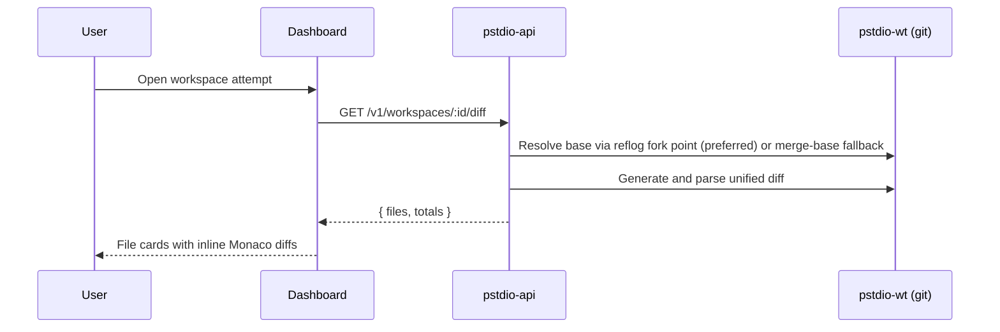

# Workspace Diff Presentation

How pstdio presents workspace diffs to users in the dashboard.

## Scope

Covers the workspace screen and diff summary badges:

- Route: `/projects/:projectId/tickets/:ticketShorthand/workspaces/:workspaceShorthand`
- Diff source: `GET /v1/workspaces/:id/diff`
- Renderer: right-side workspace diff panel

## Where Users See Diffs

### 1) Ticket board cards (summary only)

Each ticket card resolves its latest attempt and shows addition/deletion totals inside the workspace badge. Clicking the workspace badge opens the workspace page for that attempt.

### 2) Ticket details header button (summary only)

Shows attempt count and latest diff totals. Clicking opens the latest workspace when attempts exist.

### 3) Workspace page right panel (full file-by-file diff)

The selected attempt is resolved from route params. The panel fetches full diff data (files, totals, raw diff text) and renders artifacts at the top with file-by-file diffs below.

## End-to-End Flow

## Backend Diff Generation

### Endpoint

`GET /v1/workspaces/:id/diff` in `pstdio-api`.

### Validation

1. Resolve workspace by id
2. Require worktree path
3. Require and resolve associated repository

Returns typed errors (400/404) on failure.

### Diff Calculation

Handled by `pstdio-wt`:

1. **Resolve base commit** (`resolve-base.ts`): prefer the reflog fork point (the commit the worktree branch was created from), falling back to `merge-base HEAD main/master`, then the repo root commit.
2. **Discover changed files**: union of `git diff --name-status <base> HEAD` (committed), `git diff --name-status HEAD` (uncommitted), and `git ls-files --others --exclude-standard` (untracked).
3. **Full diff**: fetch old/new content and numstat per file. **Summary**: aggregate numstat totals without reading file content.

The user sees everything the attempt changed since the branch was created. Both committed and uncommitted worktree changes are included.

### Response Shape (full diff)

- `workspace_id` — the attempt identifier
- `files` — parsed per-file diff objects
- `totals` — additions, deletions, file count

### Response Shape (summary)

A lightweight `GET /v1/workspaces/:id/diff-summary` endpoint returns totals only — no file content:

- `workspace_id` — the attempt identifier
- `additions` — total added lines
- `deletions` — total removed lines
- `file_count` — number of changed files

Used by ticket board cards and the ticket details header to avoid fetching full file diffs.

## Frontend Rendering Pipeline

### Fetching

- **Board cards and ticket header**: use the lightweight diff-summary endpoint. Queries are only enabled for settled sessions (completed, failed, cancelled) to avoid unnecessary load while agents are still running.
- **Workspace page**: fetches the full diff only once the session has settled. While the session is in progress, edit actions (write/execute tool completions) trigger a debounced re-fetch (2 s) so the diff panel updates incrementally.
- Refetches on window focus

### Type Mapping

API file diff objects are transformed into UI diff types. Rename paths fall back to the primary file path when absent.

### Panel Layout

- Workspace panel remains visible even when there are no diffs
- Artifacts section shown at top when present
- Empty state is shown when there are no diffs
- Diff drawer shown below artifacts when diffs exist

### File Cards

One card per changed file, expanded by default:

- **Modified/Added**: normal file path in header
- **Deleted**: struck-through file path
- **Renamed**: old path arrow new path
- Addition/deletion counts shown as a badge
- Body renders a read-only inline Monaco diff editor

## Artifact Section

Artifacts come from `GET /v1/tickets/:ticketId/files` in `pstdio-api`. They are listed per ticket (not per attempt). Displayed as compact rows with the file extension stripped from the label.

## Errors and Empty States

### API errors

- 404 — workspace or repository not found
- 400 — workspace missing worktree or repository association
- 500 — git diff failure

### UI behavior

- No workspace selected: diff query disabled
- No files: panel shows an empty state
- Artifacts but no files: artifacts remain visible above the empty state

## Verification

1. Open a ticket with at least one attempt
2. Navigate to the workspace route for that attempt
3. Confirm the right panel shows artifact rows (if any) and one diff card per changed file
4. Edit files in the attempt worktree and wait up to 5 seconds
5. Confirm totals and file contents refresh automatically
