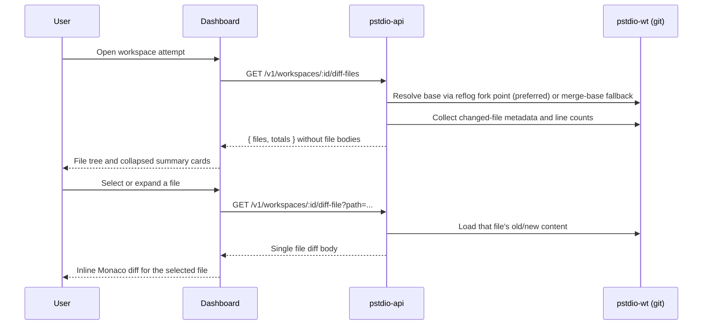

# Workspace Diff Presentation

How Prompt Studio presents workspace diffs to users in the dashboard.

## Scope

Covers the workspace screen and diff summary badges:

- Route: `/projects/:projectId/tickets/:ticketShorthand/workspaces/:workspaceShorthand`
- Diff source: `GET /v1/workspaces/:id/diff-files` plus on-demand `GET /v1/workspaces/:id/diff-file`
- File source: workspace file, directory, and entry endpoints under `GET`, `POST`, `PUT`, `PATCH`, and `DELETE`
- Renderers: workspace-owned `Files` and `Changes` Main sub-panels

## Where Users See Diffs

### 1) Ticket board cards (summary only)

Each ticket card resolves its latest attempt and shows addition/deletion totals inside the workspace badge. Clicking the workspace badge opens the workspace page for that attempt.

### 2) Ticket details header button (summary only)

Shows attempt count and latest diff totals. Clicking opens the latest workspace when attempts exist.

### 3) Workspace Main Panel (`Files` + `Diffs`)

The workspace stays the selected resource. The Main Panel has two resource-owned sub-panels:

- `Files` — a searchable file tree in the left Panel menu and a shared file renderer in the body
- `Diffs` — changed-file metadata and an on-demand diff body

`Diffs` is active on the first visit. Resource-owned layout state restores the last valid sub-panel and Files menu state on later visits. File selection uses `workspaceView: "files"` and `workspaceFilePath` metadata on the same workspace resource URI.

## End-to-End Flow

The Files flow uses the same workspace resource:

1. `GET /v1/workspaces/:id/files` lists direct children or bounded search results.
2. `GET /v1/workspaces/:id/file?path=...` reads one existing text file or supported image.
3. Editable text opens in Monaco. Opening does not format, change, or save the file.
4. `PUT /v1/workspaces/:id/file?path=...` replaces an existing UTF-8 text file after an edit.
5. `POST /v1/workspaces/:id/file?path=...` creates a file under an existing directory.
6. `POST /v1/workspaces/:id/directory?path=...` creates a directory under an existing directory.
7. `PATCH /v1/workspaces/:id/entry?path=...` moves a file without replacing an existing destination.
8. `DELETE /v1/workspaces/:id/entry?path=...` deletes a file or directory after confirmation.
9. A successful mutation invalidates file-list, selected-file, diff-files, diff-file, and diff-summary queries.

Workspace file paths are POSIX-style paths relative to the trusted workspace file root. A worktree workspace uses `workspace.worktree_path`. The default `current_branch` workspace uses the project's first server-linked repository. The shared mount rejects absolute, drive-letter, UNC, traversal, separator-confusion, null-byte, and symlink-escape paths. It skips `.git`, limits reads and writes to 1 MiB, and requires the parent directory to exist before creating an entry.

## Backend Diff Generation

### Endpoint

The workspace page uses metadata-first endpoints in `pstdio-api`:

- `GET /v1/workspaces/:id/diff-files` — changed-file metadata, counts, and totals without file bodies
- `GET /v1/workspaces/:id/diff-file?path=...` — old/new content for one requested file

`GET /v1/workspaces/:id/diff` remains available when callers need the complete diff response in one request.

### Validation

1. Resolve workspace by id
2. Require worktree path
3. Require and resolve associated repository

Returns typed errors (400/404) on failure.

### Diff Calculation

Handled by `pstdio-wt`:

1. **Resolve base commit** (`resolve-base.ts`): prefer the reflog fork point (the commit the worktree branch was created from), falling back to `merge-base HEAD main/master`, then the repo root commit.
2. **Discover changed files**: union of `git diff --name-status <base> HEAD` (committed), `git diff --name-status HEAD` (uncommitted), and `git ls-files --others --exclude-standard` (untracked).
3. **Full diff**: fetch old/new content and numstat per file. **Summary**: aggregate numstat totals without reading file content.

The user sees everything the attempt changed since the branch was created. Both committed and uncommitted worktree changes are included.

### Response Shape (workspace file metadata)

- `workspace_id` — the attempt identifier
- `files` — per-file diff objects with path, change type, additions, and deletions; content fields are omitted until requested
- `totals` — additions, deletions, file count

### Response Shape (single file body)

- `file_path` — requested path
- `old_path` / `new_path` — resolved diff paths
- `old_content` / `new_content` — file content for inline rendering
- `additions` / `deletions` — line counts for the file

### Response Shape (summary)

A lightweight `GET /v1/workspaces/:id/diff-summary` endpoint returns totals only — no file content:

- `workspace_id` — the attempt identifier
- `additions` — total added lines
- `deletions` — total removed lines
- `file_count` — number of changed files

Used by ticket board cards and the ticket details header to avoid fetching full file diffs.

## Frontend Rendering Pipeline

### Fetching

- **Board cards and ticket header**: use the lightweight diff-summary endpoint. Queries are only enabled for settled sessions (completed, failed, cancelled) to avoid unnecessary load while agents are still running.
- **Workspace Diffs sub-panel**: fetches changed-file metadata first. It requests a body only for the selected summary file. A normal expanded but unselected card does not issue a body request.
- **Workspace Files sub-panel**: fetches tree entries on demand. Search is bounded and server-backed. The selected file has its own query.
- Refetches on window focus

### Type Mapping

API file diff objects are transformed into UI diff types. Rename paths fall back to the primary file path when absent.

### Panel Layout

- `Files` and `Diffs` are sub-panels owned by the workspace Main location.
- The Files left Panel menu hosts the searchable workspace tree.
- The Files body uses the shared workbench file renderer.
- Markdown, plain text, extensionless files, and code use Monaco when the workspace contribution marks them as editable text.
- Supported images use the shared read-only image preview.
- No selection, unsupported files, oversized files, and API errors show deliberate states instead of blank editors.
- The default `current_branch` workspace supports Files through its first linked repository. Its fork-point Diffs view remains unavailable because it has no worktree branch.
- The Sidenav continues to show workspace sessions. Files and Diffs are not duplicated there.

### File Cards

One card per changed file:

- **Modified/Added**: normal file path in header
- **Deleted**: struck-through file path
- **Renamed**: old path arrow new path
- Addition/deletion counts shown as a badge
- Body renders a read-only inline diff after the selected file body is loaded
- Diffs over the large-file threshold show `Large diffs are hidden by default` until explicitly loaded

## Artifact Source Of Truth

Ticket attachments are planner-owned. Agent-produced validation, review, test,
and implementation evidence is report-owned and lives under `.pstdio/reports/`.
The dashboard loads planner ticket file metadata/content through planner
commands and should not treat ticket folders as the source of truth for result
artifacts.

When planner file metadata changes, the ticket detail surface refreshes the
planner file query so re-saved artifact content updates in place.

## Artifact Persistence Flow

`pst tickets save --id <ticket>` uploads planning/support files from:

- `.pstdio/tickets/<ticket>/files/` as regular ticket attachments

`pst reports save --name <name>` uploads report evidence from
`.pstdio/reports/<name>/files/` into report-owned blob storage.

## Errors and Empty States

### API errors

- 404 — workspace or repository not found
- 400 — a diff request is missing its required worktree or repository association
- File requests return 404 when no trusted workspace file root can be resolved
- 500 — git diff failure

### UI behavior

- No workspace selected: diff query disabled
- No files: panel shows an empty state
- Reports but no changed files: report links remain available from the ticket or workspace context

## Verification

1. Open a worktree workspace and confirm `Files` and `Diffs` are present with `Diffs` active.
2. Open Files, search for an unchanged markdown or extensionless text file, and confirm it opens in Monaco.
3. Confirm opening the file does not issue a write.
4. Edit and save the file, then open Diffs and confirm the file and saved body appear.
5. Confirm the initial Diffs load calls `/diff-files` once and calls `/diff-file` only for the selected file.
6. Confirm a supported image uses the shared preview.
7. Open the default `current_branch` workspace and confirm Files browses and edits the first linked repository through Monaco.
8. Confirm unsafe paths return `400` and a project without a linked repository gets a clear Files error.
