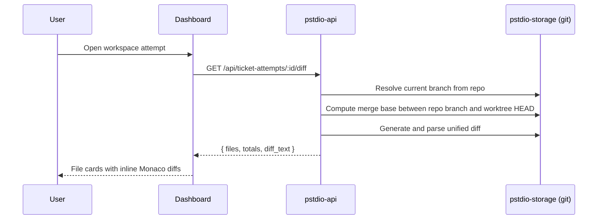

# Workspace Diff Presentation

How pstdio presents workspace diffs to users in the dashboard.

## Scope

Covers the workspace screen and diff summary badges:

- Route: `/projects/:projectId/tickets/:ticketShorthand/workspaces/:workspaceShorthand`
- Diff source: `GET /api/ticket-attempts/:id/diff`
- Renderer: right-side workspace diff panel

## Where Users See Diffs

### 1) Ticket board cards (summary only)

Each ticket card resolves its latest attempt and shows addition/deletion totals via a diff badge. Clicking the badge opens the workspace page for that attempt.

### 2) Ticket details header button (summary only)

Shows attempt count and latest diff totals. Clicking opens the latest workspace when attempts exist.

### 3) Workspace page right panel (full file-by-file diff)

The selected attempt is resolved from route params. The panel fetches full diff data (files, totals, raw diff text) and renders artifacts at the top with file-by-file diffs below.

## End-to-End Flow

## Backend Diff Generation

### Endpoint

`GET /api/ticket-attempts/:id/diff` in `pstdio-api`.

### Validation

1. Resolve workspace by id
2. Require worktree path
3. Require and resolve associated repository

Returns typed errors (400/404) on failure.

### Diff Calculation

Handled by the git-diff service in `pstdio-storage`:

1. Read the current branch name from the main repo path
2. Compute the merge base between that branch and the worktree HEAD
3. Generate a unified diff from the merge base to the current worktree state
4. Parse into structured file objects (change type, path, additions, deletions, old/new content, rename paths)

The user sees everything the attempt changed since diverging from the main repo's current branch. Both committed and uncommitted worktree changes are included.

### Response Shape

- `workspace_id` — the attempt identifier
- `mode` — always "all" for ticket-attempt diffs
- `diff_text` — raw unified diff
- `files` — parsed per-file diff objects
- `totals` — additions, deletions, file count

## Frontend Rendering Pipeline

### Polling

- Polls every 5 seconds when a workspace is selected
- Stale time matches poll interval
- Refetches on window focus

### Type Mapping

API file diff objects are transformed into UI diff types. Rename paths fall back to the primary file path when absent.

### Panel Layout

- Hidden when no diffs and no artifacts exist
- Artifacts section shown at top when present
- Diff drawer shown below artifacts when diffs exist

### File Cards

One card per changed file, expanded by default:

- **Modified/Added**: normal file path in header
- **Deleted**: struck-through file path
- **Renamed**: old path arrow new path
- Addition/deletion counts shown as a badge
- Body renders a read-only inline Monaco diff editor

## Artifact Section

Artifacts come from `GET /api/tickets/:ticket_id/files` in `pstdio-api`. They are listed per ticket (not per attempt). Displayed as compact rows with the file extension stripped from the label.

## Errors and Empty States

### API errors

- 404 — workspace or repository not found
- 400 — workspace missing worktree or repository association
- 500 — git diff failure

### UI behavior

- No workspace selected: diff query disabled
- No files and no artifacts: panel hidden
- Artifacts but no files: only artifacts shown

## Verification

1. Open a ticket with at least one attempt
2. Navigate to the workspace route for that attempt
3. Confirm the right panel shows artifact rows (if any) and one diff card per changed file
4. Edit files in the attempt worktree and wait up to 5 seconds
5. Confirm totals and file contents refresh automatically
