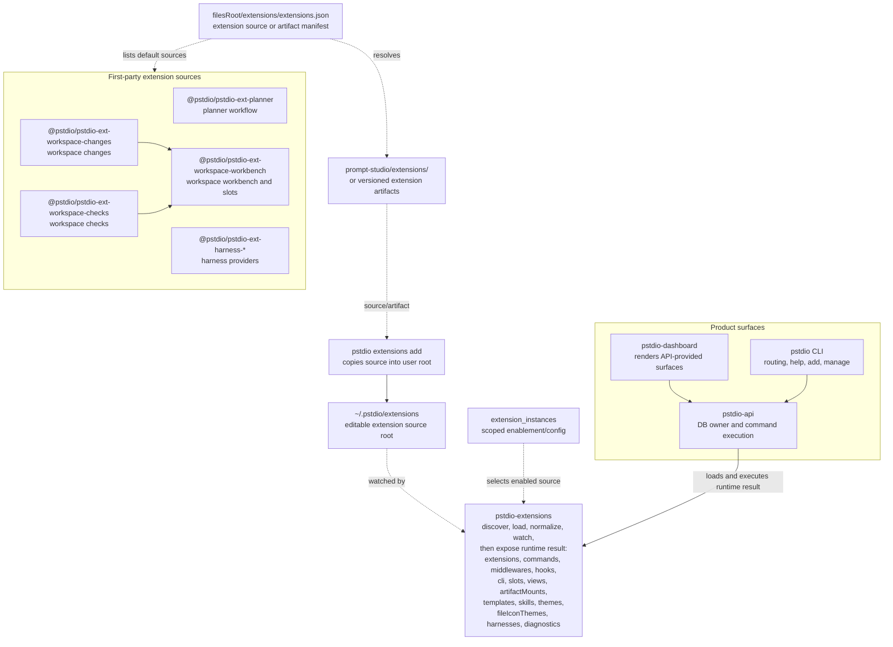

# Extension Runtime Boundaries

> Obsolete: this runtime boundary note predates the package-manifest extension identity model. Current extension identity comes from `package.json`: `publisher`, `name`, `version`, `main`, and `engines.pstdio`. Runtime ids are derived as `${publisher}.${name}`, while command ids are derived from package `name` plus the local command key, for example `extension-lab.counter.bump`. Do not use the namespace-era `defineExtension({ id, namespace, name })` examples in this document for new code.

Prompt Studio v2 uses a scope-aware extension platform, with project-scoped enablement as the common product path. The extension runtime is the only new automation model documented for future work.

The extension platform has three automation primitives:

- **Commands**: executable operations.
- **Middlewares**: command interceptors that can modify or reject a command invocation.
- **Hooks**: event subscribers that react to command lifecycle events or custom events.

Events are observable signals. They are not declared in `defineExtension()` and they do not block execution.

## Target Model

- Extension source lives in the Prompt Studio user root: `~/.pstdio/extensions/<extension-name>/`.
- Projects enable or disable installed extensions through project-scoped extension instances. The same root extension source can be used by many projects.
- If one project needs a different version of an extension, copy the extension source, change its id/namespace, and enable that copy for the project.
- Extensions are installed with `pstdio extensions add <extension>`, which works like a source installer rather than a package-only installer.
- Extension source is editable. The runtime watches enabled extension source and live-reloads on change.
- First-party extensions are listed by a source manifest or artifact manifest. The runtime does not statically import first-party extension packages.
- Extensions are defined with generic primitives from `@pstdio/sdk/extensions`.
- Extension packages may own workflow-specific contracts and optional SDKs.
- API-backed state changes run through `pstdio-api`.
- Repo-context artifact IO is allowed where the repo exists, but metadata, activity, sync, and storage mutations go through API services.
- Moving a workflow into an extension changes ownership and package boundaries; it does not remove the workflow from the product model.

## Package Ownership

| Package                        | Responsibility                                                                                                                                                          |
| ------------------------------ | ----------------------------------------------------------------------------------------------------------------------------------------------------------------------- |
| `@pstdio/sdk`                  | Generic extension primitives, runtime types, request helpers, and core clients only.                                                                                    |
| `pstdio-extensions`            | Extension loading, diagnostics, command registry, middleware registry, hook registry, package assets, artifact mounts, live reload, and API-backed runtime adapters.    |
| `pstdio-api`                   | DB ownership, domain services, extension command execution, middleware execution, activity, sync, storage, project extension toggles, and command/event runtime access. |
| `pstdio`                       | CLI command routing, help generation, `pstdio extensions add`, extension management commands, missing-command recovery, and API calls.                                  |
| First-party extension packages | Workflow-specific contracts, SDK helpers, views, commands, resources, event refs, templates, skills, and providers.                                                     |

`@pstdio/sdk` must not import from extension packages or export extension-specific contracts/clients. Extensions may import authoring primitives from `@pstdio/sdk/extensions`.

## Runtime Architecture



Diagram arrows describe runtime discovery and consumption, not package dependency direction. `pstdio-extensions` is the generic helper layer: it discovers installed extension source from `~/.pstdio/extensions`, applies scoped enablement, normalizes enabled extensions into the `loadExtensionRuntime()` result, watches source for changes, and makes runtime metadata accessible through the API. First-party defaults are data in the bundled source manifest or artifact manifest; they are not statically imported or registered by another runtime package. The CLI and dashboard both consume extension-backed behavior through API responses. `@pstdio/sdk` is not a runtime dependency in this diagram; it defines the generic authoring primitives used by extension source.

## Extension Source and `pstdio extensions add`

`pstdio extensions add` installs editable extension source into the Prompt Studio user root. When run inside a project, it also auto-enables the installed extension for that project.

```bash
pstdio extensions add planner
pstdio extensions add ./local-extension
```

Supported flags:

| Flag                    | Effect                                                                  |
| ----------------------- | ----------------------------------------------------------------------- |
| `--name <install-name>` | Override the install folder name.                                       |
| `--force`               | Replace an existing install at the target path.                         |
| `--skip-install`        | Skip the dependency-install step inside the installed extension folder. |

Behavior:

1. Resolve the extension source from a named extension (default repo `https://github.com/pufflyai/prompt-studio` at `extensions/<name>`) or a local folder path.
2. Copy the extension source into `~/.pstdio/extensions/<install-name>/` (honors `PSTDIO_HOME`).
3. Run a package manager (`bun`, `yarn`, or `npm`) inside the installed folder when a `package.json` is present (skip with `--skip-install`). Selection: prefer the PM the extension declares (`packageManager` field, then lockfile: `bun.lock`/`bun.lockb` → bun, `yarn.lock` → yarn, otherwise npm); if that PM is not on the user's `PATH`, fall back to the first of `bun`, `yarn`, `npm` that is. If none are installed, fail with a clear message (or skip with `--skip-install`).
4. Read the extension manifest from its `extension.ts` entrypoint.
5. Register the extension as an installed source.
6. When run inside a project, enable the extension for that project via the project-enablement API.
7. Run diagnostics.
8. Print the installed extension id, namespace, version, source path, and project enablement state.

The API auto-installs a configured list of default extensions on first project create using the same install primitive. Each entry is either a named extension (resolved from the Prompt Studio repo) or a local folder path. Default list: `pstdio-core-skills`, `pstdio-core-templates`.

The source layout should be simple:

```txt
~/.pstdio/extensions/
  planner/
    extension.ts
    package.json
    README.md
    templates/
    skills/
    webviews/
  workspace-workbench/
    extension.ts
    package.json
```

First-party source can live in the Prompt Studio repository under:

```txt
prompt-studio/
  extensions/
    planner/
    workspace-workbench/
    workspace-changes/
    workspace-checks/
    harness-claude-code/
```

The source manifest may point at a GitHub tree or a versioned artifact. The extension runtime should not care whether source came from GitHub, a local path, or an artifact; after `pstdio extensions add`, the source is local and editable.

## Managing Extensions

Canonical management commands:

```bash
pstdio extensions add <extension>
pstdio extensions list
pstdio extensions enable <extension-id-or-namespace>
pstdio extensions disable <extension-id-or-namespace>
pstdio extensions remove <extension-id-or-namespace>
pstdio extensions check
```

Recommended meanings:

| Command                             | Meaning                                                                                                                                      |
| ----------------------------------- | -------------------------------------------------------------------------------------------------------------------------------------------- |
| `pstdio extensions add <extension>` | Install source into `~/.pstdio/extensions` and auto-enable it for the current project when run inside one.                                   |
| `pstdio extensions list`            | Show installed source and project-scoped enablement state.                                                                                   |
| `pstdio extensions enable <id>`     | Enable an installed extension for the current project.                                                                                       |
| `pstdio extensions disable <id>`    | Stop loading the extension for the current project. Keep source and extension data.                                                          |
| `pstdio extensions remove <id>`     | Remove the project association. Keep root source unless an explicit destructive flag is added later.                                         |
| `pstdio extensions check`           | Validate extension source, scoped enablement, command paths, slots, assets, mounts, settings, templates, skills, harnesses, and diagnostics. |

Extension instance state is API-owned. Disabling or removing an extension from a project does not delete its storage, project records, or repo artifacts by default.

## Live Reload

Installed extension source is editable by users and coding agents. The runtime should watch enabled source roots under `~/.pstdio/extensions` and reload on change.

Reload behavior:

- Invalidate the runtime cache for affected projects.
- Re-normalize commands, middlewares, hooks, views, slots, templates, skills, themes, file icon themes, artifact mounts, and diagnostics.
- Publish updated runtime metadata through the API.
- Surface load failures through diagnostics.
- Avoid requiring a CLI/dashboard restart for local development where practical.

The runtime should treat source changes as normal extension development. Coding agents can create a new extension, modify an installed extension, or copy an extension to make a project-specific variant.

Appearance contributions are normalized as first-class runtime records. `themes` point at `vscode-color-theme` JSON/JSONC package assets and are converted into app theme token overrides plus Monaco theme data. `fileIconThemes` point at `vscode-file-icon-theme` JSON/JSONC package assets and expose icon definitions and file name/extension resolver maps. Diagnostics cover invalid package asset descriptors, missing assets, malformed JSONC, and missing icon font files.

## Extension Identity and Namespaces

An extension has three related names:

| Concept        | Example          | Purpose                                                                                  |
| -------------- | ---------------- | ---------------------------------------------------------------------------------------- |
| Extension id   | `pstdio.planner` | Stable provider identity. Used in diagnostics, activity, and scoped enablement.          |
| Namespace      | `planner`        | CLI namespace, artifact namespace, default event prefix, and human-facing command scope. |
| Install folder | `planner`        | Local source folder under `~/.pstdio/extensions`.                                        |

Example:

```ts
export default defineExtension({
  id: "pstdio.planner",
  namespace: "planner",
  name: "Planner",
});
```

The namespace scopes canonical CLI paths and repo artifact mounts:

```txt
pstdio planner tickets create
.pstdio/planner/tickets
```

If a project needs a customized version, copy the extension source and change at least the extension id and namespace:

```txt
~/.pstdio/extensions/planner-custom/
```

```ts
export default defineExtension({
  id: "project.planner-custom",
  namespace: "planner-custom",
  name: "Planner Custom",
});
```

## Extension-Owned SDKs

An extension package can expose public subpaths for other extensions:

- `<package>/contract` for slots, event refs, command refs, resources, providers, and shared types.
- `<package>/sdk` for builders, typed clients, and helper functions.

For example, planner integrations import planner helpers from `@pstdio/pstdio-ext-planner/contract` or `@pstdio/pstdio-ext-planner/sdk`, not from `@pstdio/sdk`.

Events do not need to be declared in `defineExtension()`. Extension-owned contracts may export typed event refs so other extensions can subscribe safely:

```ts
export const plannerEvents = {
  ticketCreated: eventRef<{ ticketId: string; title: string }>(
    "planner.ticket.created",
  ),
};
```

## Top-Level Extension Shape

The core extension shape is intentionally small:

```ts
export default defineExtension({
  id: "pstdio.planner",
  namespace: "planner",
  name: "Planner",

  commands: {},
  middlewares: {},
  hooks: {},

  slots: {},
  views: {},
  settingsPanels: {},
  activityRenderers: {},
  sessionAnchorRenderers: {},

  artifactMounts: {},
  templates: {},
  templateTypes: {},
  skills: {},
  harnesses: {},
  workspaceTypes: {},

  initialSetup: async (ctx) => {},
  migrate: async (ctx, fromVersion) => {},
});
```

## Commands

Commands are the executable primitive for CLI, UI buttons, menus, command panel, automation, schedules, and hooks.

Commands do not need a `target` field. The invocation context provides the current project, repo, resource, slot context, CLI params, and caller metadata.

```ts
import { defineExtension, params } from "@pstdio/sdk/extensions";
import { workspaceSlots } from "@pstdio/pstdio-ext-workspace-workbench/contract";

export default defineExtension({
  id: "project.review",
  namespace: "review",
  name: "Review",

  commands: {
    run: {
      title: "Run review",
      description: "Start a review session for the current workspace.",

      params: {
        prompt: params.text().optional(),
      },

      menus: [
        {
          slot: workspaceSlots.headerPrimary,
          label: "Run review",
        },
      ],

      cli: {
        path: ["run"],
        description: "Start a review session for a workspace.",
        examples: ["pstdio review run --workspace <id>"],
      },

      async run(ctx) {
        const workspace =
          ctx.resource?.type === "workspace" ? ctx.resource : undefined;

        await ctx.sessions.create({
          title: "Review workspace",
          prompt: ctx.params.prompt ?? "Review this workspace.",
          anchors: workspace ? [{ ...workspace, role: "primary" }] : [],
        });
      },
    },
  },
});
```

Stateful command execution belongs behind the API command execution boundary. Client-side command metadata can support help, forms, command panel entries, and diagnostics, but persisted behavior runs in the API-owned runtime.

## Command Panel

All commands are available to the command panel by default.

A command can opt out:

```ts
commands: {
  "internal.reindex": {
    title: "Reindex planner data",
    commandPanel: false,
    async run(ctx) {},
  },
}
```

The command panel is not a separate automation model. It is a UI surface over the command registry. Visibility can be filtered by command metadata, project enablement, slot/resource context, params, and future capability rules.

## CLI Exposure

The canonical CLI path is namespace-scoped:

```txt
pstdio <extension.namespace> <command path>
```

Example:

```ts
export default defineExtension({
  id: "pstdio.planner",
  namespace: "planner",
  name: "Planner",

  commands: {
    "tickets.create": {
      title: "Create ticket",
      cli: {
        path: ["tickets", "create"],
        description: "Create a planner ticket.",
      },
      async run(ctx) {},
    },
  },
});
```

Canonical command:

```bash
pstdio planner tickets create
```

The CLI router should:

1. Resolve the current project and repo context.
2. Ensure the API is available.
3. Request enabled extension command metadata from the API.
4. Build namespace-scoped help.
5. Parse argv into command params.
6. Execute stateful commands through the API command endpoint.

Optional aliases may be added later, but the canonical command path remains namespace-scoped. Path collisions must fail with diagnostics naming the provider extensions and command ids.

## Command Execution Lifecycle

Executing a command automatically emits command lifecycle events.

```txt
ctx.commands.execute(command)
  -> emit command.requested
  -> run middlewares
  -> if rejected: emit command.rejected and return rejected outcome
  -> emit command.started
  -> run command
  -> emit command.completed or command.failed
```

Lifecycle events are ordinary events. Hooks can subscribe to them, but they cannot block the command.

Recommended lifecycle names:

| Event       | Meaning                                               |
| ----------- | ----------------------------------------------------- |
| `requested` | `ctx.commands.execute(...)` was called.               |
| `started`   | Middlewares passed and command execution is starting. |
| `completed` | Command finished successfully.                        |
| `rejected`  | Middleware rejected the command before it ran.        |
| `failed`    | The command threw or returned a failed outcome.       |

A helper can create typed command event refs:

```ts
commandEvent(plannerCommands.tickets.create, "completed");
commandEvent(plannerCommands.tickets.create, "rejected");
```

## Middlewares

Middlewares intercept command execution before the command runs.

They can:

- continue unchanged
- replace params
- patch params
- replace invocation context when allowed by the runtime
- reject execution

They are used for normalization, defaulting, validation, policy checks, shorthand expansion, and other pre-command behavior.

```ts
middlewares: {
  normalizeTicketTitle: {
    command: plannerCommands.tickets.create,

    async handler(ctx) {
      return ctx.commands.replaceParams({
        ...ctx.params,
        title: String(ctx.params.title ?? "").trim(),
      });
    },
  },

  rejectDoomTicket: {
    command: plannerCommands.tickets.create,

    async handler(ctx) {
      const title = String(ctx.params.title ?? "");

      if (title.toUpperCase().includes("DOOM")) {
        return ctx.commands.reject({
          code: "doom_rejected",
          reason: `Ticket title "${title}" contains DOOM — refusing.`,
        });
      }
    },
  },
}
```

Middleware ordering is not guaranteed in the initial API. Extension authors must not rely on one middleware running before another. An explicit sequencing model can be added later if a concrete product need appears.

Because ordering is not guaranteed, command owners should keep critical normalization and invariants inside the command or expose explicit helper commands when sequencing matters.

## Events and Hooks

Events are observable signals emitted by the kernel or extensions.

Events do not need to be declared in `defineExtension()`. Runtime enforcement should not depend on a closed list of event names. Typed event refs may be exported from extension contract packages for better authoring.

Custom event emission:

```ts
await ctx.events.emit(plannerEvents.ticketCreated, {
  ticketId: ticket.id,
  title: ticket.title,
});
```

Hooks subscribe to events:

```ts
hooks: {
  recordTicketCreatedActivity: {
    event: plannerEvents.ticketCreated,

    async handler(ctx, event) {
      await ctx.activity.record({
        message: `Created ticket ${event.ticketId}`,
        target: { type: "ticket", id: event.ticketId },
      });
    },
  },

  notifyCreateRejected: {
    event: commandEvent(plannerCommands.tickets.create, "rejected"),

    async handler(ctx, event) {
      await ctx.notify.toast({
        type: "warning",
        title: "Ticket creation blocked",
        message: event.reason,
      });
    },
  },
}
```

Hooks cannot reject, mutate, or resume the command that emitted the event. Use middleware when behavior needs to affect command execution.

## Slots and Slot-Provided Context

The owner of a rendered surface owns the slots inside that surface.

| Surface              | Slot Owner                           |
| -------------------- | ------------------------------------ |
| Project workbench        | Kernel SDK                           |
| Session workbench        | Kernel SDK                           |
| Workspace page workbench | `@pstdio/pstdio-ext-workspace-workbench` |
| Ticket pages         | `@pstdio/pstdio-ext-planner`         |

Generic slot primitives live in `@pstdio/sdk/extensions`; named domain slots live in the owning extension package.

A slot defines both:

- where a contribution appears
- what context the host workbench will provide when the contribution is invoked or rendered

Example ticket slot contract:

```ts
export type TicketSlotContext = {
  resource: { type: "ticket"; id: string };
  ticket: {
    id: string;
    title: string;
    statusId?: string;
  };
};

export const ticketSlots = {
  headerOverflow: defineSlot<TicketSlotContext>(
    "planner.ticket.header.overflow",
    { kind: "menu" },
  ),
};
```

A command attached to that slot receives the slot-provided context when invoked:

```ts
commands: {
  "tickets.archive": {
    title: "Archive ticket",
    menus: [{ slot: ticketSlots.headerOverflow }],

    async run(ctx) {
      const ticketId = ctx.resource?.type === "ticket"
        ? ctx.resource.id
        : undefined;

      if (!ticketId) {
        throw new Error("A ticket is required.");
      }

      await archiveTicket(ctx, ticketId);
    },
  },
}
```

Slot kind is a compatibility tag. It tells the runtime what kind of contribution can attach to the slot, such as `menu`, `view`, `settings`, `renderer`, or `navigation`. It does not mean every contribution is an iframe.

## UI Contributions

UI contributions are attached to host-provided slots.

Host-rendered contributions include:

- menu items
- toolbar buttons
- sidebar navigation entries
- command panel entries

Extension-rendered UI contributions use transport-safe webview descriptors:

- side panels
- tabs
- settings pages
- activity renderers
- session anchor renderers
- custom routes

Extensions must not provide React components, dashboard component references, or other in-process UI objects through extension definitions. Product surfaces receive contribution metadata from the API, resolve the target slot, and render the contribution through the appropriate host renderer or webview host boundary.

Example settings page:

```ts
settingsPanels: {
  plannerSettings: {
    title: "Planner",
    slot: projectSlots.settingsPanels,
    webview: {
      entry: packageAsset("./webviews/settings/index.tsx", import.meta.url),
    },
  },
}
```

Example side panel:

```ts
views: {
  plannerSidebar: {
    title: "Planner",
    slot: projectSlots.sidebar,
    webview: {
      entry: packageAsset("./webviews/sidebar/index.tsx", import.meta.url),
    },
  },
}
```

Webviews opt into host operations with explicit capabilities. Unversioned declarations use the current v1 contract; `@1` is accepted for extensions that want to pin the version in source. Unsupported capability names or versions are reported as extension diagnostics, and runtime calls to undeclared capabilities are rejected by the host bridge.

```ts
webview: {
  entry: packageAsset("./webviews/sidebar/index.tsx", import.meta.url),
  capabilities: ["commands.execute", "preferences.set@1"],
}
```

The v1 declarable host capabilities are:

- `commands.execute`
- `resource.open`
- `notification.show`
- `preferences.get`
- `preferences.set`
- `activity.emit`
- `diagnostics.report`

`host.dispatchKeyboardEvent` is always available — the guest runtime forwards keyboard shortcuts on its own, so it is enabled wherever the host implements it and does not need to be declared.

### Rendering webviews through the workbench

`pstdio-workbench` stays extension-agnostic: every widget names a `rendererId`, and the workbench
host only looks up that renderer and calls it. Bridge webviews use
`BRIDGE_WEBVIEW_RENDERER_ID` from `pstdio-extensions/workbench`; their bridge descriptor is carried
as widget `config` with `runtimeUrl`, `moduleUrl`, optional `styles`, and declared
`capabilities`.

`pstdio-extensions/workbench` provides the bridge renderer through `createBridgeWebviewRenderer`,
which accepts two optional factories so a host can supply its own wiring:

- `createHostCapabilities(context)` — builds the `HostCapabilityRegistry` the guest's
  capability calls resolve against. Defaults to `createWorkbenchWebviewHostCapabilities`, which
  maps capabilities onto workbench-core registries. The dashboard injects its own factory so
  `commands.execute` reaches the extension command REST API, `resource.open` uses router
  navigation, and `notification.show` raises a dashboard toast.
- `createProps(context)` — builds the props pushed into the guest's `propsStore`. Defaults to
  `{ placement, resource }`. The dashboard injects a factory that also forwards the latest
  extension command outcome and theme preference.

Plain `.html` webview entries are unsupported. Extension-rendered UI is built as a managed
bridge module and loaded through the bridge runtime.

## Planner Boundary

Internal ticket management is owned by `@pstdio/pstdio-ext-planner`, not by `@pstdio/sdk`.

`@pstdio/pstdio-ext-planner` owns:

- the default Prompt Studio ticket workflow
- planner ticket resources
- planner command refs and event refs
- ticket slots and slot context contracts
- planner diagnostics
- planner-specific typed clients and SDK helpers
- local ticket artifact behavior
- ticket frontmatter and display-title helpers
- ticket pull/push behavior
- ticket templates and skills
- planner settings pages

Ticket commands call the planner boundary for ticket management behavior.

## Artifact Mounts and Local Files

`.pstdio` remains repo context for files coding agents should inspect or edit.

Generic artifact mounts are scoped by extension namespace and cannot escape that namespace root.

```ts
export default defineExtension({
  id: "pstdio.planner",
  namespace: "planner",

  artifactMounts: {
    tickets: {
      path: "tickets",
      label: "Tickets",
    },
  },
});
```

The mount above resolves to:

```txt
<repo>/.pstdio/planner/tickets
```

Invalid mount paths:

```txt
/tmp/planner
../planner
.pstdio/tickets
../../anything
```

The runtime must normalize paths and prevent escaping:

```txt
<repo>/.pstdio/<extension.namespace>/...
```

Examples:

```txt
.pstdio/planner/tickets/PS-123/ticket.md
.pstdio/workspace-checks/reports/check-123.md
.pstdio/review/artifacts/review-456.md
```

Preferences, statuses, and other active project state live in API-owned storage. Extension template and skill content is stored in installed extension source files.

## Templates and Skills

Extensions can contribute default templates and skills as package/source assets. The extension examples are the source of truth for the contract: catalog services resolve these assets by extension instance plus contribution key and do not create project file rows for extension-owned assets. Template edits through the dashboard/API write back to the installed extension source file. Skill edits happen in the installed extension source folder and extension setup installs those skills into each enabled agent directory for the project.

```ts
templateTypes: {
  ticket: {
    title: "Ticket",
    description: "Templates used to create planner tickets.",
  },
},

templates: {
  defaultTicket: {
    title: "Default Ticket",
    type: "ticket",
    source: packageAsset("./templates/default-ticket.md", import.meta.url),
  },
},

skills: {
  triageTicket: {
    title: "Triage Ticket",
    source: packageAsset("./skills/triage-ticket.md", import.meta.url),
  },
}
```

Runtime behavior:

| Item               | Behavior                                                                      |
| ------------------ | ----------------------------------------------------------------------------- |
| Extension template | Source asset edited in the installed extension folder or dashboard.           |
| Extension skill    | Source asset edited in the installed extension folder.                        |
| Skill setup        | Installed to all configured agents enabled for the project.                   |
| Disablement        | Stored as project preference.                                                 |
| Catalog shape      | Uses `source_kind = "extension"`; project rows use `source_kind = "project"`. |
| Copy/customize     | Creates project-owned preference state or a copied extension source.          |
| Project variation  | Edited by changing the extension asset files directly.                        |

Template and skill source edits should happen in the installed extension folder, such as `~/.pstdio/extensions/<extension-name>/templates/` or `~/.pstdio/extensions/<extension-name>/skills/`. The dashboard template editor uses the same source files for extension templates. File changes in those folders refresh enabled projects the same way changes to extension source do.

If only one project should receive a variation, copy the extension folder, change the extension `id` and `namespace`, enable that copy for the project, and edit files in the copied extension.

## Data Boundary

The API is the only DB owner.

- CLI, dashboard, TUI, SDK consumers, and extension adapters do not import `pstdio-db`.
- Extension command handlers that mutate project state execute through API services.
- Extension storage is scoped by extension instance; project-owned state also carries project id.
- Project enablement is stored as API-owned extension instance state.
- Activity records use generic resource refs and include source extension ids.
- CLI and dashboard consume extension runtime metadata through API responses.

## Repo Context

Project context identifies shared Prompt Studio state. Repo context identifies the local repo used for filesystem and runtime work.

Command execution should carry repo context when local files or execution paths are involved:

```ts
type ExecuteCommandInput = {
  command: string;
  params?: Record<string, unknown>;
  resource?: ResourceRef;
  repoId?: string;
  repoPath?: string;
};
```

The CLI can pass `repoPath` from the current working directory. The API validates project/repo membership and resolves durable repo context before executing the command.

Artifact mounts are bound to the selected repo or workspace. API-backed project state remains project-scoped unless a command explicitly stores repo-scoped state.

## Diagnostics

`pstdio extensions check` should validate:

- invalid or missing extension entrypoints
- duplicate extension ids
- duplicate namespaces in one project
- invalid command metadata
- CLI path collisions
- middleware command references
- hook event references where refs are typed
- unresolved slots
- invalid slot kind usage
- invalid package/source assets
- invalid webview entries
- artifact mount conflicts
- artifact mount path escapes
- extension storage migration failures
- template and skill asset failures
- unavailable harness executable detection
- project enablement state that points to missing source

Diagnostics should include extension id, namespace, source path, project id, repo context when relevant, and command ids when relevant.

## Documentation Rule

Product and architecture docs should describe the extension platform as the user-facing system contract.

Use this terminology consistently:

| Term           | Meaning                                                                              |
| -------------- | ------------------------------------------------------------------------------------ |
| Command        | Executable operation.                                                                |
| Middleware     | Pre-command interceptor that can modify or reject execution.                         |
| Event          | Observable signal, either automatic command lifecycle event or custom emitted event. |
| Hook           | Event subscriber.                                                                    |
| Slot           | Host-defined mount point with a typed context contract.                              |
| Webview        | Transport-safe custom UI descriptor for extension-rendered UI.                       |
| Artifact mount | Repo-visible `.pstdio/<namespace>/...` file mount.                                   |

## Open Areas for Future Expansion

The accepted boundary intentionally leaves these areas open until the product needs them:

- Middleware sequencing.
- Extension capability declarations and permission prompts.
- Extension dependency and version constraints.
- Durable event delivery versus best-effort hooks.
- Uninstall and purge semantics for extension-owned storage and artifacts.
- Marketplace or remote trust model.
- Webview bridge versioning and typed message channels.
- Scheduled command repo-context selection.
- Extension source update conflict handling when local edits exist.
