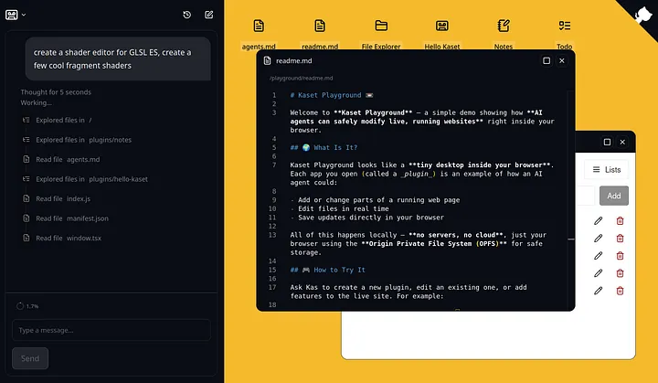
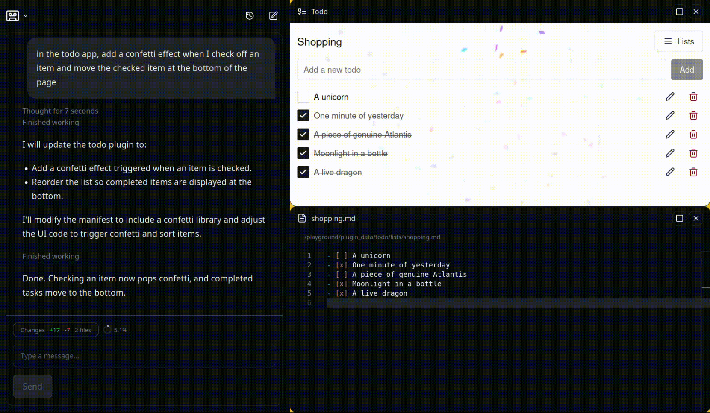

*First published in Data Science Collective on October 25, 2025. This essay describes Kaset, the framework I was exploring then. Read the follow-up, [From malleable software to Prompt Studio](/blog/users-in-the-development-team/), for how these ideas inform Prompt Studio today.*

Twenty years ago, I tried to build a mod for a video game I loved.
It was my first attempt at coding and it did not go well at all.
I was too ambitious, too impatient, and I didn’t know what files modified the game the way I wanted.
After a week of frustration, I gave up, convinced that writing software just wasn’t for me.

I went into design and it wasn’t until much later that I picked up coding again, driven by a sense of powerlessness: I wanted to create my own tools, not just use what others had built.

That feeling, of wanting to make software adapt to my workflow, rather than the other way around, is what brought me back, but it took many years of studying and writing software before I could finally understand how to build the things I cared about.

## New Vibes

Fast-forward to today, and everything has changed.

If I wanted to build that same mod now, I could probably “vibe-code” it in a few hours, even if I wasn’t a developer.

Modern coding agents and generative tools are blurring the line between users and developers, but we’re still only scratching the surface of what software could become.

Current “vibe coding” solutions take a holistic view of software creation, allowing non-technical users to assemble entire applications.
More interesting in my mind is the intersection between the professional developer and the everyday user.
Some problems are simply too complex to “vibe-code” without a solid understanding of software fundamentals.
A professional using AI will almost always produce more reliable and thoughtful results than a layperson relying on AI automation.

What’s far more compelling to me is a hybrid model, one where users and developers create software together.
In this setup, software could evolve organically, adapting in real time to genuine needs rather than assumptions.
Users, informed by their lived experience, would shape interfaces, workflows, and behaviors to fit their unique contexts, while developers focus on the deeper technical architecture, performance, and providing the environment needed for thoughtful customization.

> To explore this hybrid model, I created Kaset: an open source framework for building software your users can further customize.

## Old Vibes

Today, the way we build software still follows the cycle: build it, ship it, use it, fix it.
Developers try to anticipate user needs, layering on features that many will never use.
The result is often bloated systems that are intimidating for newcomers and must remain rigid to account for experts who have invested time learning their quirks.
Any small change can alienate both groups at once.

## Customizable Software Today

Open-source is the most powerful path to deep customization, but it demands technical literacy and is inaccessible for most users.
A gentler entry point are plugin ecosystems: tools like VS Code, Figma, and Obsidian thrive because anyone can extend them through a clear interface.
Similarly, integrations and automation layers like Zapier, or Notion’s API let users connect tools and build workflows that suit their needs without touching the core code.

Currently most systems are designed with the assumption that a human writes every PR, plugin, or glue script.
Now that code can write code, we could extend those paths dramatically.

## Building Malleable Software

Let’s briefly go over two important concepts that shaped the development of Kaset.

### Information Substrates

Researchers like Michel Beaudouin-Lafon and the Ink & Switch collective have been exploring a different kind of foundation for software: information substrates.

An information substrate is like digital clay.
It’s a shared, flexible material that any number of tools can shape, without locking the data inside a single silo.
Just like in the physical world, where you can use the same hammer, ruler, or knife across many materials, digital tools could become general-purpose and interchangeable.

This enables a few things:

- Data isn’t trapped inside one app, it’s shared and composable.
- Tools are portable and interoperable.
- Users can remix and appropriate software for their own needs.

This vision demands that we rethink everything: how we structure digital matter, how interfaces work, and who gets to modify them.

> In Kaset, text files are the information substrate. Both coding agents and your applications can read them, edit them, and subscribe to changes.

In the [todo app example](https://kaset.dev/playground), Kaset helps store the application state as a set of markdown files.
This allows the coding agent to read and edit them without needing custom tools.

### Instrumental Interfaces

The companion idea to substrates is the instrumental interface, or tool-based interface.

Instead of one giant app with every feature pre-defined, imagine a collection of small, independent tools, each capable of acting on shared digital material.
A color picker or a script tool that manipulates data.

These tools are not locked inside apps; they can be used between contexts.
You can grab a tool from one place and use it elsewhere.
They are interoperable, independent, and composable, just like Unix command-line.

“Tool use” APIs now let AI agents invoke external capabilities, through protocols like MCP.
More recently, agents can build reusable tools themselves, as demonstrated by Claude Skills.
These systems extend the Unix-like model of small, composable tools into the realm of AI, where AI agents can orchestrate and chain capabilities across contexts.

## A Framework for Building Malleable Software

Over the past months, I’ve been working on Kaset, a framework designed to explore this new kind of software.

*The [Kaset Playground](https://kaset.dev/playground) is a website that looks like a desktop. You can see Kaset in action by generating plugins and tools just for you that extend the way the website works.*

Kaset is built around one idea: your application can be defined as an editable file system (substrate) accessible by coding agents (instrumental interface).

It brings coding agents into the browser, so users can directly modify, extend, and remix the app they’re using, within boundaries provided by the app developers.

It applies all code edits locally.
There is no need to run expensive build pipelines for every customization and users can have their own unique version of the app.

Kaset doesn’t need you to define a complex agentic setup for your application.
A simple coding agent and instructions stored in a `agents.md` file are enough.

Instead of waiting for a feature request to reach the dev team, a user could simply ask the system:

> “Add a button that exports my data to CSV.”

*A user modifying the behavior of a deployed todo app live in the browser.*

### Enforcing guardrails

Ensuring that AI-generated code runs safely, doesn’t expose credentials or breaks isolation, is a crucial part of Kaset’s design.
This topic deserves a deeper dive than fits here, so I’ll cover how Kaset enforces these guardrails in an upcoming post.

In a world where software was truly malleable, my teenage self probably wouldn’t have spent a week failing to mod a game and I might never have felt forced to learn to code.

Ironically, I’m glad I did; I love building software.
But it shouldn’t have to be everyone’s path.
Deep engineering knowledge will still matter, just not as a prerequisite for making useful tools.

Kaset is early and evolving in the open.
I’d love your feedback, use cases, and `agents.md` patterns.
Join the discussions, share examples, and help shape secure, sensible defaults for building modable applications.

Ready to see it in action?
You can try an early version of Kaset in the [Playground](https://kaset.dev/playground).

Want to learn more?
Check out our [documentation](https://kaset.dev/).

Have ideas or questions?
Find us in the [Kaset discussions](https://github.com/pufflyai/kaset/discussions).
