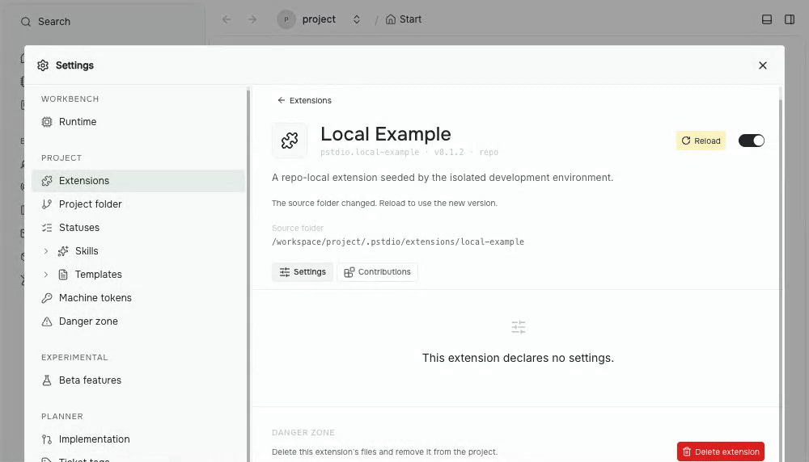

Build a tool, try it, change it, and load the next version. Prompt Studio 0.37 makes that loop easier to manage from extension settings. It also fixes conversation problems that could stop you from continuing with an agent, and adds signed Windows installers with automatic updates.

## Load the next version of your tool

Extension settings now distinguishes two kinds of update. An installed tool with a newer release offers **Upgrade**; **Upgrade all** updates all installed extensions that have newer versions. A local tool whose source has changed offers **Reload**, which validates and loads that project's files.

You can also drop an extension folder into settings. Prompt Studio copies it into the project's `.pstdio/extensions` folder and loads it there. The project gets its own copy of the tool.

*Recorded in 0.39 using a disposable local extension. Its source was edited before recording. Reload adopts the change; the Contributions tab shows the updated command. These update and repair controls ship in 0.37.*

When a local tool fails to load, **Reload** reports the actual validation error for that project's source. Failed extensions also offer **Copy error**, and **Upgrade** when available. This gives you something concrete to pass to the agent fixing the tool.

The repair loop is concrete: read the error, ask the agent to fix that source, and reload the result. See [extension installation and loading](/docs/references/extensions/manifest-and-installation/) for the rules.

## Keep a conversation going after a problem

Chat problems appear in the conversation, where the affected work is visible. A message that could not be sent remains as **Not sent**, and temporary failures offer **Retry**. You can dismiss a problem you no longer need to see. The first message of a new session no longer blanks for a few frames.

More importantly, a saved conversation and an agent's history can disagree without making the session read-only. Reconciliation keeps the saved conversation, so you can continue instead of hitting **Conversation cannot continue**.

There are fixes for individual harnesses too:

- Codex conversations can continue after code-mode commands.
- An OpenCode question can be answered even when an earlier turn failed.
- Thinking-level selection works again for Claude Code, Codex, and OpenCode. Its icons match the Planner priority colors, with a flame for **Max**.

## Install on Windows, use the CLI anywhere

Windows users get signed x64 desktop installers and automatic updates. Desktop installations on macOS, Windows, and Linux make the bundled `pst` command available too.

The command line is useful beyond setup. Agents can invoke an extension's declared operations through the same handler its interface uses. If you are building a tool, ask for [CLI-ready actions](/docs/guides/extensions/cli-ready-actions/) alongside its page.

## Smaller fixes and extension changes

- Project navigation stays mounted while selection changes, and settings entries appear as their data arrives.
- Extensions can declare clipboard writes, and tool authors get a shared copy button. The bridge permission makes the intended capability explicit.
- Edited numeric controls save on blur, and **Apply** stays clear of the side-panel button.
- Notes shows its title without an extra navigation label.
- Extension API `alpha.14` requires explicit navigation and resource removal. Use compatible extension builds when upgrading this host release.

The upgrade also repairs duplicate folder registrations. Each folder belongs to one workspace; extra workspaces and older project entries sharing a newer project's home folder are removed. Review this migration in the release notes if your setup contains duplicate registrations.

These highlights come from the released changesets. See the [0.37 release notes](https://github.com/pufflyai/prompt-studio/releases/tag/pstdio%400.37.0), tagged [core changelog](https://github.com/pufflyai/prompt-studio/blob/pstdio%400.37.0/packages/pstdio/CHANGELOG.md#0370), [UI changelog](https://github.com/pufflyai/prompt-studio/blob/pstdio%400.37.0/packages/ui/CHANGELOG.md#0370), and [all changes since 0.36.1](https://github.com/pufflyai/prompt-studio/compare/pstdio@0.36.1...pstdio@0.37.0). The [Codex](https://github.com/pufflyai/prompt-studio/blob/pstdio%400.37.0/extensions/harness-codex/CHANGELOG.md#0370) and [OpenCode](https://github.com/pufflyai/prompt-studio/blob/pstdio%400.37.0/extensions/harness-open-code/CHANGELOG.md#0370) changelogs detail their conversation fixes.
