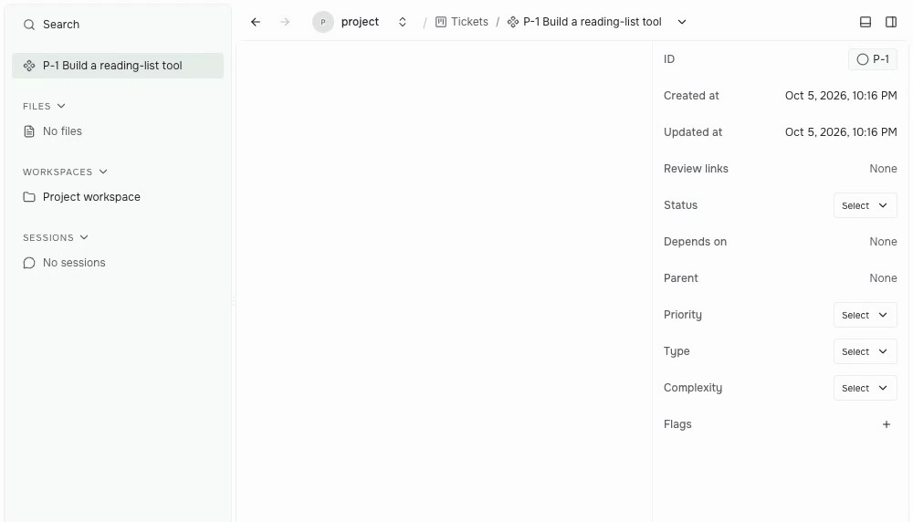

Prompt Studio 0.38 adds workspace choices to extension commands and opens new terminals in the project folder when no workspace is selected. This post also covers **0.37**: extension upgrade controls, conversation recovery, and signed Windows installers.

## Extension updates

From 0.37, **Upgrade** installs a newer release and **Upgrade all** updates every eligible extension. **Reload** validates and loads edited local source for the current project.

*Recorded in 0.39 with a sample local extension edited before capture. Reload and these repair controls shipped in 0.37.*

Drop an extension folder into settings to copy it into the project's `.pstdio/extensions` folder. If a local tool fails to load, use **Copy error** to give the agent the validation error, fix the source, and reload.

See [extension installation and loading](/docs/references/extensions/manifest-and-installation/).

## Workspace choices

In 0.38, extension commands can declare a `workspace` parameter. The form uses installed providers to offer the same types and fields as **Create workspace**.

For example, choose a Git worktree and its base branch before an agent starts, so its changes stay on a separate branch.

*Recorded in 0.39 with a sample Planner ticket; no agent is run. The shared input shipped in 0.38, and Planner's Run attempt choices were restored in 0.39.*

Agents can pass the same workspace choice as structured JSON through [CLI-ready actions](/docs/guides/extensions/cli-ready-actions/#use-typed-inputs-and-readable-results), without each tool building a separate workspace form.

## Agent conversations

The 0.37 changes keep unsent messages visible as **Not sent** and offer **Retry** for temporary failures. Saved and agent history can be reconciled without making the conversation read-only.

- Codex conversations continue after code-mode commands.
- OpenCode questions can be answered after an earlier turn fails.
- Thinking-level selection works again for Claude Code, Codex, and OpenCode.

## Windows and terminals

0.37 adds signed Windows x64 desktop installers and automatic updates. Desktop installations on macOS, Windows, and Linux also provide the bundled `pst` command, including [CLI-ready extension actions](/docs/guides/extensions/cli-ready-actions/).

In 0.38, a new terminal starts in the project root when no workspace is selected, saving a manual directory change. With a workspace selected, it starts there.

## Other changes

- Extensions with the same name in different folders load their own views, so a test copy does not conflict with another project's tool.
- Planner badges show workspace names, including the project folder name instead of **default**.
- Clipboard writes and a shared copy button are available to extensions; edited numeric controls save on blur.
- Extension API **alpha.14** requires explicit navigation and resource removal. Use compatible extension builds.
- Upgrading removes duplicate workspace folder registrations and older projects sharing a newer project's home folder, allowing sessions to start again. Check the release notes if your setup has duplicate registrations.
- Planner owns automation; its separate Automation extension is removed from the Marketplace.

## Release notes

- **0.38:** [0.38 release notes](https://github.com/pufflyai/prompt-studio/releases/tag/pstdio%400.38.0), [0.38 core changelog](https://github.com/pufflyai/prompt-studio/blob/pstdio%400.38.0/packages/pstdio/CHANGELOG.md#0380), [Planner changelog](https://github.com/pufflyai/prompt-studio/blob/pstdio%400.38.0/extensions/pstdio-planner/CHANGELOG.md#0380).
- **0.37:** [0.37 release notes](https://github.com/pufflyai/prompt-studio/releases/tag/pstdio%400.37.0), [core changelog](https://github.com/pufflyai/prompt-studio/blob/pstdio%400.37.0/packages/pstdio/CHANGELOG.md#0370), [UI changelog](https://github.com/pufflyai/prompt-studio/blob/pstdio%400.37.0/packages/ui/CHANGELOG.md#0370), [Codex](https://github.com/pufflyai/prompt-studio/blob/pstdio%400.37.0/extensions/harness-codex/CHANGELOG.md#0370), [OpenCode](https://github.com/pufflyai/prompt-studio/blob/pstdio%400.37.0/extensions/harness-open-code/CHANGELOG.md#0370).
- [all changes from 0.36.1 to 0.38](https://github.com/pufflyai/prompt-studio/compare/pstdio@0.36.1...pstdio@0.38.0).
