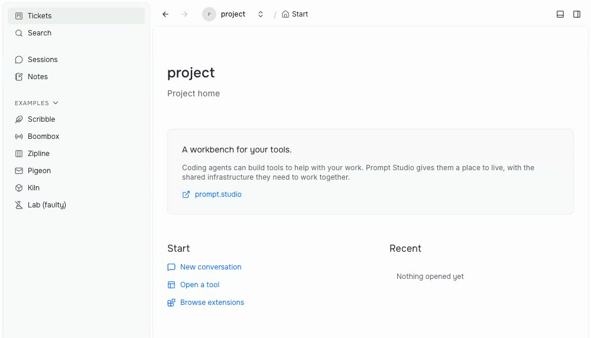

Prompt Studio 0.39 adds tool-specific sidebars, shared saved board views, and native toolbar actions. Multiple open chats share one connection, so they no longer stall other views.

## Tool sidebars

Notes shows your notes in the sidebar; Sessions shows conversations grouped by day. Click the project breadcrumb to return to the main navigation.

*Recorded in 0.39 with sample notes. Tickets is pinned to the header and stays available inside Notes and Sessions.*

Header, footer, and pinned rows stay visible inside a tool. Tool-owned lists keep their own order, so sidebar customization does not reorder notes or dated conversations.

Drag and drop shows the insertion point and receiving group, supports moving rows out of groups, and keeps empty header and footer sections available as drop targets. Long customization menus scroll within the window.

Extension authors can add [sidebar levels](/docs/references/extensions/contribution-api/#sidenav-levels) to their tools.

## Saved board views

Saved views and defaults now belong to the project, so another client or agent can reuse your filters and sorting. Agents read the configuration through the [board-view CLI](/docs/references/cli/board-views/).

Prompt Studio stores the view; extensions own its content. Planner, for example, refreshes open boards when ticket tags or their options change.

## Chats and tabs

- Open chats share one session stream connection, avoiding the browser connection limit.
- Slow view reads keep loading instead of failing after 30 seconds.
- Unchanged extension webview bundles are reused across restarts, reducing startup work.
- Crowded closable tabs shrink before scrolling. Selecting a session from a tab's menu keeps it in that tab, and opening an already displayed resource reuses its tab.

## Extension APIs

Extensions can add toolbar actions to native views and load command parameter choices from their data. For example, put a command button on a table instead of building a custom webview, and make it [CLI-ready](/docs/guides/extensions/cli-ready-actions/) for agents.

Resource resolver commands refresh an open page's title, icon, and menus after its data changes. Tree and card menus use the clicked resource's metadata.

The extension API adopts semantic version **0.1.0**. Declare `^0.1.0` to accept compatible additions and fixes; a minor API release below 1.0 can still break compatibility.

See [API versioning](/docs/references/extensions/api-versioning/) before changing an extension's supported range.

## Other fixes

- Planner's **Run attempt** restores workspace type and base branch choices. Archived tickets can be restored with **Unarchive** or `pst tickets unarchive`.
- Workspace provider parameters are validated before creation.
- Chat and Markdown lists display numbers of 100 and above in full, and image insertion works after quick keyboard selection.
- The Claude Code model picker lists Opus once.

## Release notes

[0.39 release notes](https://github.com/pufflyai/prompt-studio/releases/tag/pstdio%400.39.0), [core changelog](https://github.com/pufflyai/prompt-studio/blob/pstdio%400.39.0/packages/pstdio/CHANGELOG.md#0390), [Planner changelog](https://github.com/pufflyai/prompt-studio/blob/pstdio%400.39.0/extensions/pstdio-planner/CHANGELOG.md#0390), [all changes since 0.38](https://github.com/pufflyai/prompt-studio/compare/pstdio@0.38.0...pstdio@0.39.0).
