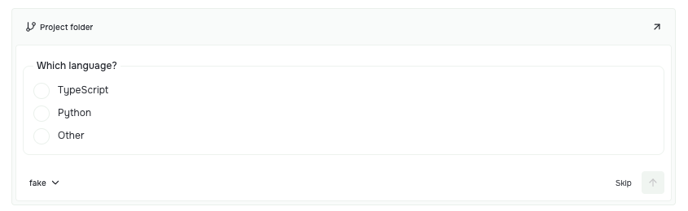

An agent asks which language you want to use. It has reached a decision that belongs to you. The conversation should make that pause clear, let you answer, and keep the work moving.

Prompt Studio 0.40 makes that handoff more explicit. It also fixes the small interruptions around it: a timer that loses its place, a layout that changes when you return to a project, or a panel menu that opens in the wrong form.

## A question is not a finished task

A harness can now ask through the host's question channel. While it waits for your answer, the session shows a waiting state instead of looking finished. The host owns that state; the harness owns how the agent asks and continues.

The question form gives you a few clear ways forward. Pick a suggested answer, choose **Other** and write your own, or **Skip** the question. In a single-choice question, free text is one answer rather than an extra value beside a selected option.

*The real workbench question form, captured with a sample harness. This still shows where to find Other and Skip; it does not represent a provider's generated conversation.*

For example, if the agent offers TypeScript and Python but your project uses Rust, you can give that answer directly. You do not have to turn a short decision into a new explanation of the whole task.

Answers can also identify the specific question they belong to. That matters when more than one question is pending: answering one should not accidentally resolve another.

Harnesses with a live reply protocol can accept the answer inside the current run. This is an optional capability, so the exact continuation depends on the harness you use. The [agents and harnesses reference](https://github.com/pufflyai/prompt-studio/blob/pstdio%400.40.0/documentation/references/architecture/0002-agents.md#session-execution) explains the host question channel and reply contract.

## Keep work visible while it continues

Waiting for you and waiting for background work mean different things.

The **Claude Code harness** now keeps its session running while Claude waits for its own background task. When that task ends, it reports the result. A background task no longer makes the session look finished before its work is done.

The chat work timer also stays anchored to the current agent run across navigation and reloads. You can leave the conversation to inspect a file, then return without resetting the elapsed work time.

Selected harness parameters are remembered when you reopen a conversation or start a new session. Your next prompt should begin with the settings you chose, rather than send you back through the same controls.

## Come back to your setup

Each project now keeps its own workbench layout, including the Side Panel, across project switches, reloads, and desktop restarts.

That makes a practical difference when projects need different arrangements. One might keep a reference open beside the conversation; another might give the editor more room. Switching between them should restore each project's setup.

Leaving a tool's sidebar level through the project breadcrumb now returns to your last root-level page. Going into Notes and back out should bring you back to the page you were using.

Panel menus also behave more consistently. They reopen attached when there is room, float in panels 580 pixels wide or narrower, and size floating menus to their content. A narrow panel gets a usable menu without forcing the wide-panel layout into it.

## Two useful additions for extension authors

The SDK exposes the question handoff described above: `HarnessStartInput.questions`, correlated answers through `QuestionResponse.callId`, and optional `HarnessSession.replyQuestion` for live replies. A harness remains responsible for its provider's protocol. Core handles the session lifecycle around the exchange.

Extension API **0.1.1** also adds the optional `HarnessProvider.dispose` callback. A harness that owns persistent workers or connections can release them when its extension reloads, is disabled in a scope, or the host shuts down. Finishing an ordinary turn does not trigger this cleanup.

This gives those resources a clear owner and a clear end. It is a lifecycle hook for harness authors, rather than a new agent you need to configure. See [persistent worker cleanup](https://github.com/pufflyai/prompt-studio/blob/pstdio%400.40.0/documentation/references/architecture/0002-agents.md#persistent-worker-cleanup) and [API versioning](/docs/references/extensions/api-versioning/).

## Find your tickets from the action menu

The **Planner extension** adds **Open tickets** to its command palette. Use it to reach your tickets from the action menu instead of first finding the Planner page in the sidebar.

Planner owns this workflow; the workbench provides the place to discover and invoke its command. That is the same approach extensions use to make their tools available where people and agents work.

## Release sources

These highlights come from the consumed changesets for 0.40, checked against the tagged package changelogs. The release was published on October 6; the changelog was prepared on October 2.

Read the [0.40 release notes](https://github.com/pufflyai/prompt-studio/releases/tag/pstdio%400.40.0), the tagged [core changelog](https://github.com/pufflyai/prompt-studio/blob/pstdio%400.40.0/packages/pstdio/CHANGELOG.md#0400), [SDK changelog](https://github.com/pufflyai/prompt-studio/blob/pstdio%400.40.0/packages/sdk/CHANGELOG.md#0400), [UI changelog](https://github.com/pufflyai/prompt-studio/blob/pstdio%400.40.0/packages/ui/CHANGELOG.md#0400), and [workbench changelog](https://github.com/pufflyai/prompt-studio/blob/pstdio%400.40.0/packages/pstdio-workbench/CHANGELOG.md#0400).

The extension-specific fixes are in the [Claude Code harness changelog](https://github.com/pufflyai/prompt-studio/blob/pstdio%400.40.0/extensions/harness-claude-code/CHANGELOG.md#0400) and [Planner changelog](https://github.com/pufflyai/prompt-studio/blob/pstdio%400.40.0/extensions/pstdio-planner/CHANGELOG.md#0400). You can also inspect [all changes since 0.39](https://github.com/pufflyai/prompt-studio/compare/pstdio@0.39.0...pstdio@0.40.0).
