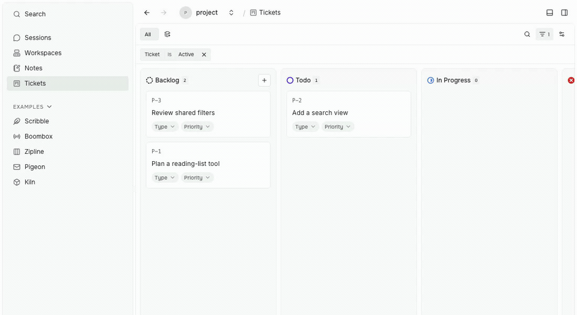
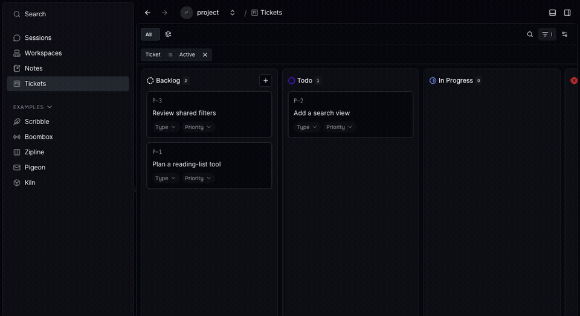
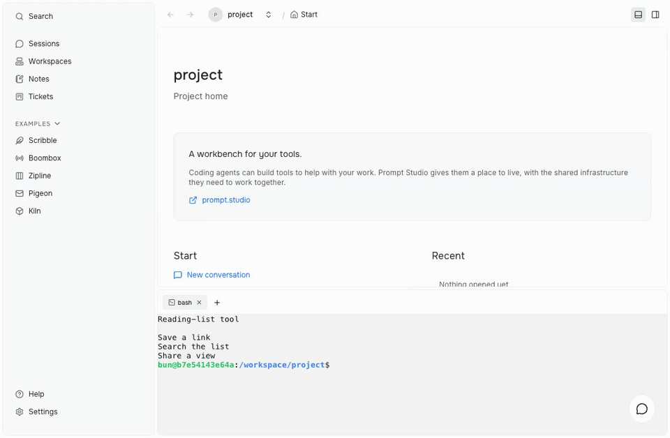
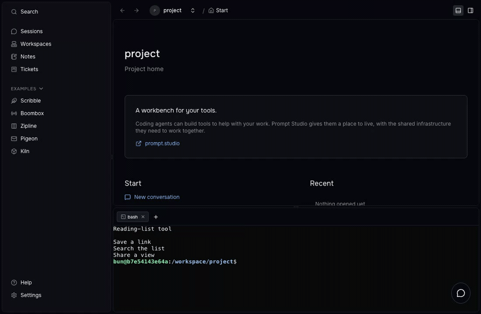
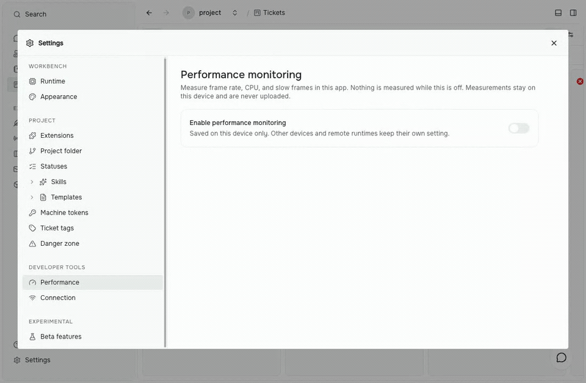
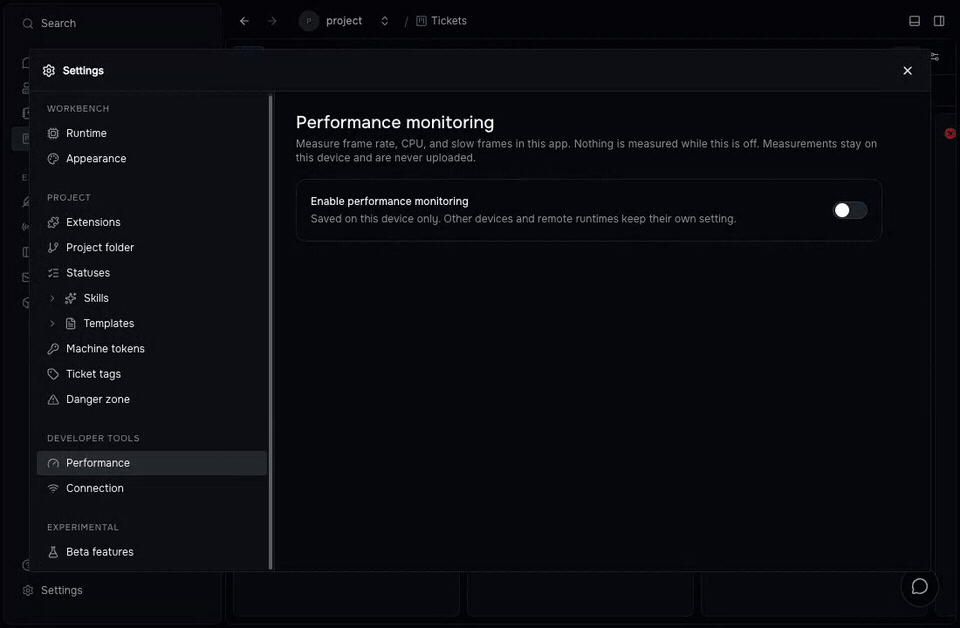

Find the work you need, arrange your tools around it, and keep the conversation moving. Prompt Studio 0.41 brings shared collection controls, movable tabs, and optional performance monitoring.

## Filter once, save your view

Boards and tables now share search, filters, sorting, and saved views. Pick values first, combine rules with **AND** or **OR**, and save the result for your project. Workspaces gets the same controls as ticket boards.

Filter tickets, save the view, and return to it. Captured in an isolated development build with sample tickets. [Light video](../../../../../documentation/images/prompt-studio-0-41-views-light.mp4) · [Dark video](../../../../../documentation/images/prompt-studio-0-41-views-dark.mp4)

Multiselect keeps your choices while you work. Clear empty-state messages explain when filters hide everything. Kanban boards also support panning and easier edge scrolling while you drag cards.

## Put each tool where you want it

Move tabs between workbench panels, reorder them, and use grouped right-click actions to manage them. **Add** opens a tool in the panel you chose. You can rename sessions or reset the layout when you want a fresh arrangement.

Move a live terminal with its menu, then drag it back. [Light video](../../../../../documentation/images/prompt-studio-0-41-tabs-light.mp4) · [Dark video](../../../../../documentation/images/prompt-studio-0-41-tabs-dark.mp4)

Sidebar order, placement, and visibility now survive desktop restarts. Status bar widgets can also be dragged or reordered with the keyboard, and their positions are saved.

## See what slows the app down

Turn on **Settings → Developer tools → Performance** to add a frame-rate meter. Open it to inspect the workbench and extension views, pause an extension, or resume it when you need it again.

Enable monitoring and open the frame-rate popover. [Light video](../../../../../documentation/images/prompt-studio-0-41-performance-light.mp4) · [Dark video](../../../../../documentation/images/prompt-studio-0-41-performance-dark.mp4)

CPU measurements are available in the desktop app. Agents can read them through `pst performance`. An optional connection indicator is also available in Developer tools. When the backend disconnects, the workbench keeps loaded navigation visible and reconnects stalled streams.

## Keep the agent conversation moving

- **Native commands:** harnesses can expose slash completion and their own composer tags, status indicators, and actions. Available commands depend on your harness.
- **Questions in the composer:** Claude Code and Codex can ask for a choice and receive your answer or **Skip** in the live run. Long questions have clickable summaries with answers below.
- **Drafts stay yours:** text and attachments stay with their session when you switch a Side Panel tab. Question forms and plan decisions preserve the draft they temporarily replace.
- **Open referenced files:** chat file links open the right document, including its source position and workspace file links. Local images preview in chat.

## Make the workbench feel familiar

Choose a theme from **Appearance** and preview it before committing. Escape restores your previous choice. The desktop app remembers the theme across launches and uses it for startup, recovery, and closing screens too.

Workspaces now appears in the sidebar, extension tools appear in search, and page links open the project they name. If initial project setup fails, the Start page explains why and offers **Retry setup**.

## A smoother Planner workflow

- **Clear start conditions:** Run attempt explains when a dependency prevents a ticket from starting.
- **Workspace cleanup:** unused ticket workspaces are deleted, and merging marks the ticket done. Workspace deletion replaces archiving.
- **Archive views:** ticket filters can load archived tickets; removing the archive filter shows active and archived work together.
- **Settings beside the tool:** implementation settings live on Planner’s extension page, with a target-branch dropdown.

Planner owns these ticket workflows. Other extensions use the same workbench and command interfaces.

## New building blocks for extensions

Extensions can link project resources through the SDK, HTTP, and CLI, and load setting choices from a command in extension API **0.1.2**. Sessions they start also respect the model options they pass.

Editing an installed extension’s skills now refreshes agent skill folders automatically. A failed extension registration leaves other tools available and retries on refresh. Artifacts also gains optional header search and configurable UX refinement prototypes.

Extension authors should review the UI and workbench API changes: collection controls replace older filter and ordering exports, and shared host storage replaces the dedicated Kanban storage provider.

## Safer local access and installation

Browsers sign in through a single-use link opened by `pst`. Sessions are kept separate for each local runtime. Extension installs follow their shipped lockfile and no longer run package lifecycle scripts.

The macOS installer gains a branded drag-to-Applications window. The desktop app also warns about running work in a dialog before closing.

## Release notes

Read the [0.41 core changelog](https://github.com/pufflyai/prompt-studio/blob/fbde3ed96/packages/pstdio/CHANGELOG.md#0410), [SDK changelog](https://github.com/pufflyai/prompt-studio/blob/fbde3ed96/packages/sdk/CHANGELOG.md#0410), [UI changelog](https://github.com/pufflyai/prompt-studio/blob/fbde3ed96/packages/ui/CHANGELOG.md#0410), and [workbench changelog](https://github.com/pufflyai/prompt-studio/blob/fbde3ed96/packages/pstdio-workbench/CHANGELOG.md#0410). Extension changes are in the [Planner](https://github.com/pufflyai/prompt-studio/blob/fbde3ed96/extensions/pstdio-planner/CHANGELOG.md#0410), [Claude Code](https://github.com/pufflyai/prompt-studio/blob/fbde3ed96/extensions/harness-claude-code/CHANGELOG.md#0410), and [Codex](https://github.com/pufflyai/prompt-studio/blob/fbde3ed96/extensions/harness-codex/CHANGELOG.md#0410) changelogs.
