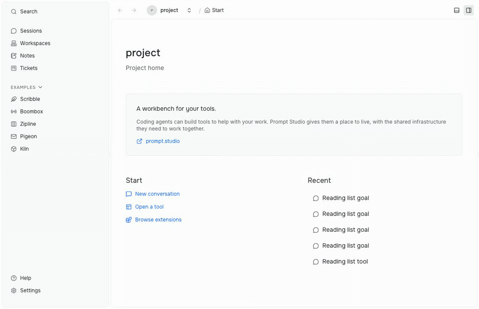
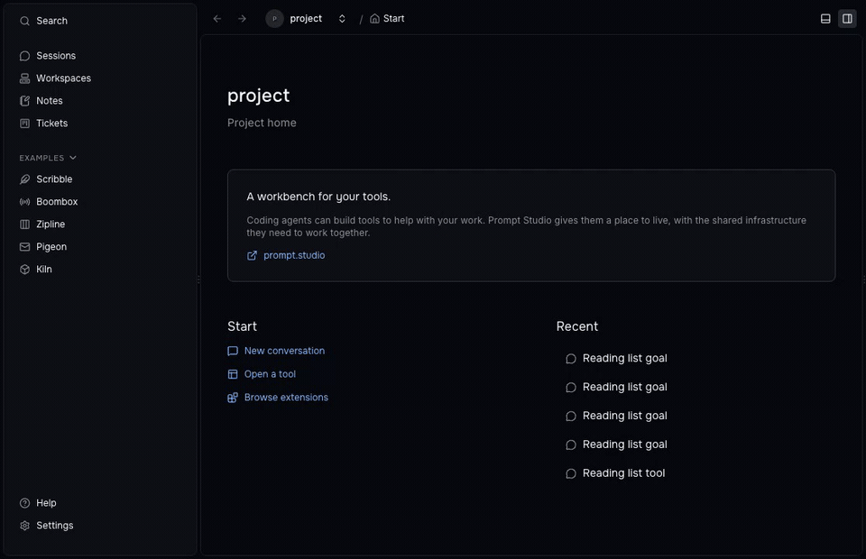
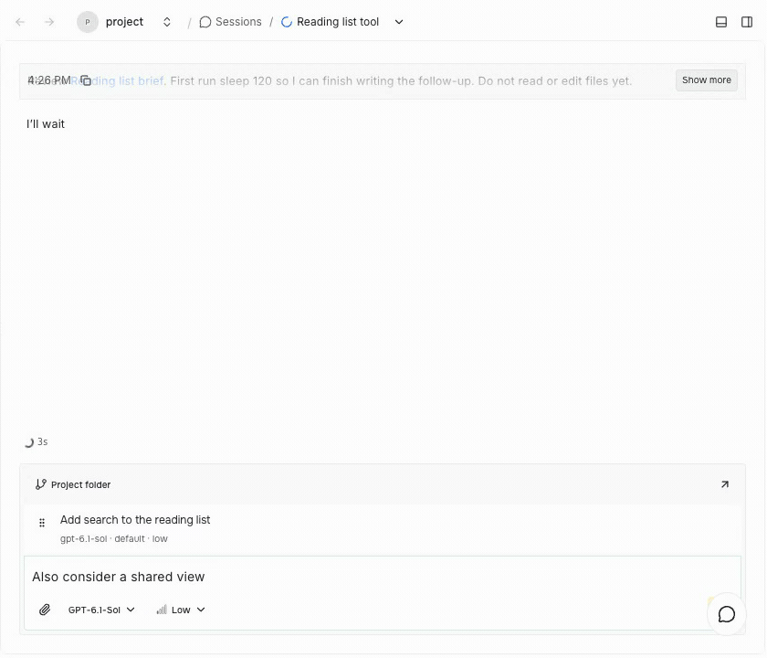
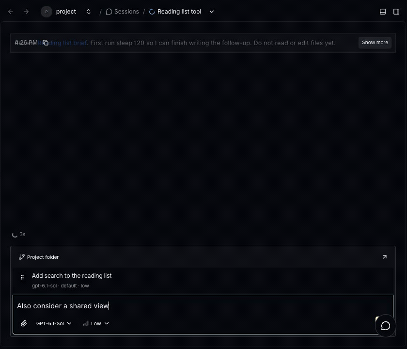
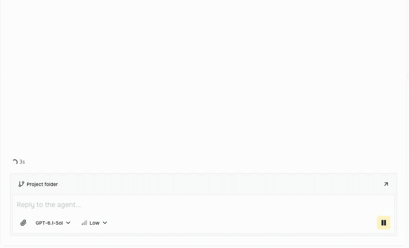
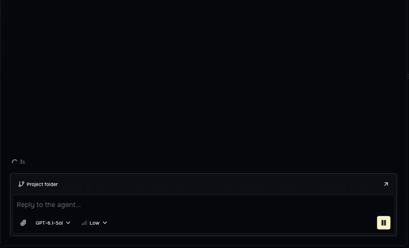
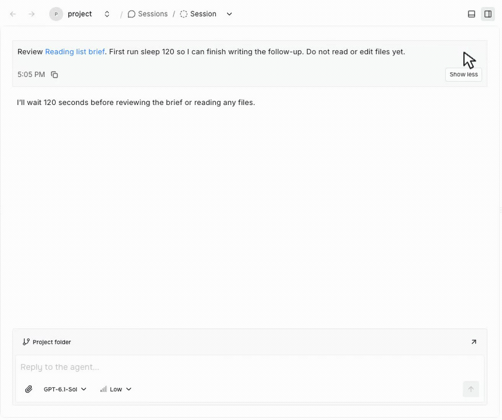
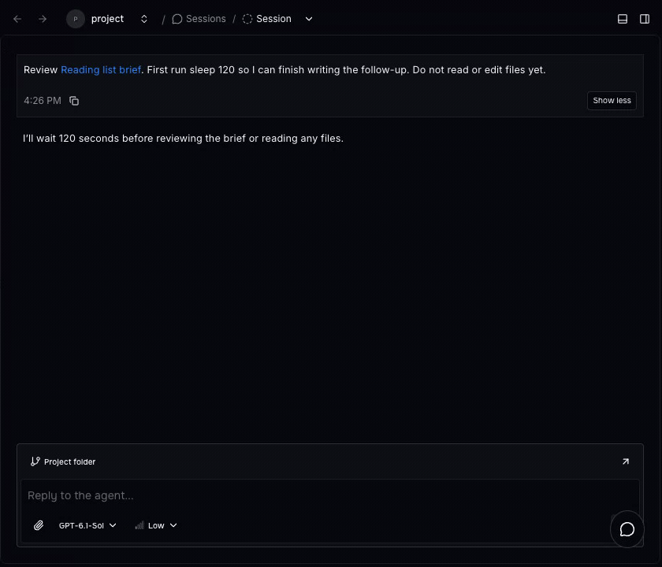

Prompt Studio 0.42 adds sidebar groups, complete queued-message editing, native agent commands, and saved Planner document links. Group tools for a project, revise a follow-up while an agent works, or give Codex a goal you can change in the same conversation.

## Sidebar groups and shortcuts

Right-click a sidebar row and choose **New group**, enter a name, then drag rows onto the group. Collapse it to hide its tools, or rename it as your project changes.

Create a Writing group, move Notes into it, and rename it to Project writing. Recorded in the isolated 0.42 build with a disposable project and sample extensions.

Groups remember their names, members, order, and placement for each project and navigation tree. Removing a group returns its rows to their original sections; **Reset to default** clears custom groups.

Assigned extension shortcuts now appear under extension names and in the keyboard shortcut reference. Navigation and creation commands also show their shortcuts in the command palette.

## Queued messages

Edit a queued follow-up without interrupting the current run. The editor preserves its model, options, and attachments, and keeps your separate unsent draft while you revise the queued request.

Drag follow-ups into the order you want, revise a queued message, and save it with Update. Your unsent draft stays in the editor. Recorded in the isolated 0.42 build with a sample Codex conversation.

Combine queued requests that use matching settings into one follow-up. Their text keeps its queue order, and shared attachments appear once.

If a request starts running while you are editing it, keep your changes as a new queued message or restore them to your draft.

**Send now** is available only when the harness supports steering active work. Saving a queue edit keeps it queued; sending it into the current run is a separate action.

## Native agent commands

The command interface introduced in 0.41 gains native implementations in the Codex, Claude Code, and OpenCode harnesses. Available commands and controls follow the selected agent's capabilities.

Choose `/goal` from the command menu, set an objective, then pause and edit it through the Goal controls. Recorded in the isolated 0.42 build with a sample Codex conversation.

- **Codex goals:** use `/goal <objective>`, then pause, resume, edit, or clear the native goal. Changing the objective during active work keeps the current turn running and steers subsequent turns in the same conversation.
- **Codex planning:** use `/plan` to select planning mode. A completed native proposal offers **Approve and implement**, which starts implementation in the same thread. `/compact` compacts the native conversation.
- **Claude Code:** use native commands, including `/plan` and `/compact [instructions]`. Native questions and approval requests stay connected to the workbench's reply controls.
- **OpenCode:** discover and invoke native commands. `/compact` and `/summarize` use the selected provider and model; OpenCode's Plan agent does not add a `/plan` alias.

For example, give Codex a goal to update a tool, then edit that goal while it works. Prompts and commands share the same native session, so you can change direction without starting another conversation.

## Planner document links

Open a saved Planner document through a stable link, including links shared in chat. The link opens the document page for its project, with the ticket's navigation and actions.

An agent can get the ticket body link with `pst tickets document-link --id PS-12`, or add `--file research.md` to link a saved file. You can also share the open document's URL.

Click the Reading list brief link in the conversation to open its saved Planner document. Recorded in the isolated 0.42 build with sample Planner content.

## Resource links and actions

With a supported resource selected, use **Related resources** in the command palette to inspect incoming and outgoing links. **Link resource** searches resources exposed by enabled extensions and lets you choose a purpose for the link.

For example, a tool author can expose a document and a task as linkable resources. Connect them and open the document from the task's related resources instead of searching for it again.

Link changes refresh across clients. Missing or disabled destinations keep their saved reference, and you can remove the link.

Extensions own their resources and navigation targets. The shared controls do not automatically make every Planner or Artifacts view linkable; there is no automatic Related resources button in the page header.

Extension authors can add resource moves with an immediate preview and placement feedback, renames that update before the save finishes, and removals that ask for confirmation. Selected panel resources expose their actions in breadcrumbs, and loaded tab titles remain visible while refreshing.

## Extension installation

Dropping an extension folder in the dashboard and running `pst extensions add <path>` use the same host installation process. The host installs dependencies and validates the extension before adopting it.

People and agents get the same installation result. When the API runs on another machine, the source goes to that host rather than installing only on the machine running the CLI.

Replacing an installed source requires confirmation in the dashboard or `--force` in the CLI. If validation fails, the existing installed files stay intact.

For tool authors, `pst extensions check <path>` checks local source without installing it. `pst extensions dev <path>` watches local edits and sends changed source to the host for validation and reload.

## Extension APIs

- **Command streams:** typed extension commands can emit results as they work, then send a final outcome. A tool processing several files can show each result as it arrives. Existing commands need to adopt streaming to use it.
- **Stream cancellation:** webviews, SDK clients, and the CLI share the client's transport. CLI commands use `--stream` to print events and the final outcome; Ctrl+C cancels the stream.
- **Saved collection views:** custom extension screens can reuse the shared search, filters, and saved-view header. Extension commands can create, update, reorder, and select default views in the same project storage used by native boards and tables.

## Agent setup and performance

- **Clear setup problems:** the harness picker and `pst agents list` explain when a CLI is missing, too old, or fails its version check. Supported minimums are Codex **0.157.0**, Claude Code **2.1.203**, and OpenCode **1.0.175**, with no maximum version.
- **Windows discovery:** npm-installed OpenCode and other agent commands can be discovered through their command wrappers.
- **Responsive conversations:** chat streaming does less repeated rendering and scrollbar style work. Extension webview messages no longer leave host listeners behind, helping the workbench stay responsive while tools remain open.
- **Floating tools:** floating panel webviews receive a usable viewport.

## Release sources

These highlights were checked against the [0.42 release notes](https://github.com/pufflyai/prompt-studio/releases/tag/pstdio%400.42.0) and the changelogs at the [`pstdio@0.42.0`](https://github.com/pufflyai/prompt-studio/tree/c5030d0001f867b5661dd51cda16256503419715) tag.

- [Core changelog](https://github.com/pufflyai/prompt-studio/blob/c5030d0001f867b5661dd51cda16256503419715/packages/pstdio/CHANGELOG.md#0420), [SDK changelog](https://github.com/pufflyai/prompt-studio/blob/c5030d0001f867b5661dd51cda16256503419715/packages/sdk/CHANGELOG.md#0420), [UI changelog](https://github.com/pufflyai/prompt-studio/blob/c5030d0001f867b5661dd51cda16256503419715/packages/ui/CHANGELOG.md#0420), and [workbench changelog](https://github.com/pufflyai/prompt-studio/blob/c5030d0001f867b5661dd51cda16256503419715/packages/pstdio-workbench/CHANGELOG.md#0420).
- [Planner changelog](https://github.com/pufflyai/prompt-studio/blob/c5030d0001f867b5661dd51cda16256503419715/extensions/pstdio-planner/CHANGELOG.md#0420).
- [Codex changelog](https://github.com/pufflyai/prompt-studio/blob/c5030d0001f867b5661dd51cda16256503419715/extensions/harness-codex/CHANGELOG.md#0420), [Claude Code changelog](https://github.com/pufflyai/prompt-studio/blob/c5030d0001f867b5661dd51cda16256503419715/extensions/harness-claude-code/CHANGELOG.md#0420), and [OpenCode changelog](https://github.com/pufflyai/prompt-studio/blob/c5030d0001f867b5661dd51cda16256503419715/extensions/harness-open-code/CHANGELOG.md#0420).
- [Native command mappings and supported versions](https://github.com/pufflyai/prompt-studio/blob/c5030d0001f867b5661dd51cda16256503419715/documentation/references/extensions/0016-native-harnesses.md), [saved collection views](https://github.com/pufflyai/prompt-studio/blob/c5030d0001f867b5661dd51cda16256503419715/documentation/references/extensions/0017-saved-collection-views.md), and [resource linking command](https://github.com/pufflyai/prompt-studio/blob/c5030d0001f867b5661dd51cda16256503419715/packages/pstdio-workbench/src/react/resource-links/resource-links-module.tsx).
