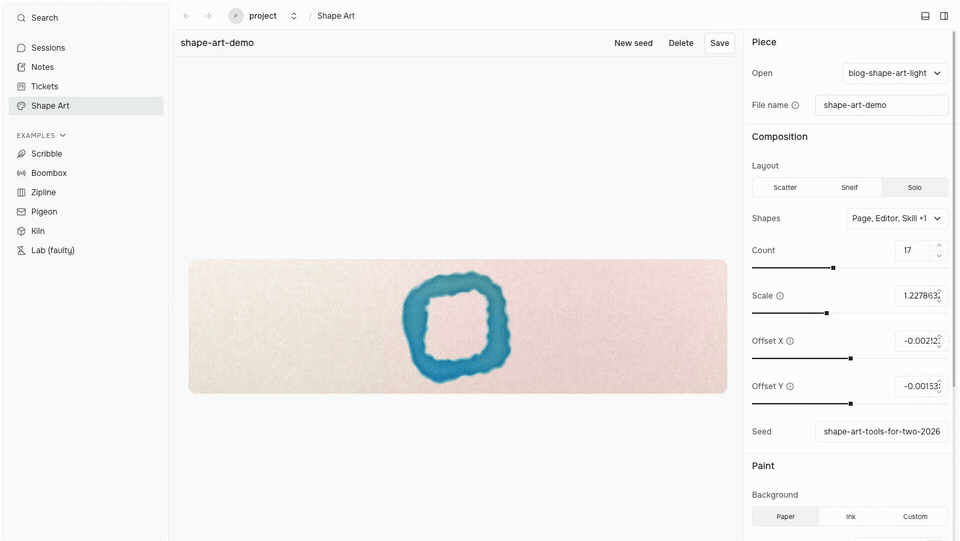

This blog needed banners.
I wanted each post to have its own image, with a consistent visual language and versions that worked on light and dark pages.
Finding and adjusting them by hand would have become another little job to keep doing.

So I built a little tool with my coding agent.
It is called Shape Art, and it paints the images you see at the top of these posts.

It starts with the six shapes I use to explain Prompt Studio’s building blocks: pages, commands, editors, skills, hooks, and automation.
It arranges them on a sheet, then adds soft edges, uneven pigment, and grain.
The result looks like watercolor, but every image comes from a small set of saved settings.
No image model is involved in painting a piece.

## Make something you want to look at

The editor gives me a preview on the left and controls on the right.
I can scatter shapes, rest them on a shelf, or paint one large shape.
I can choose which shapes appear, move the composition, change the background, and adjust the paint.

The preview changes as I work.
**New seed** gives the same settings another arrangement and texture.
It is a quick way to try a few versions before choosing one.



*A real capture of Shape Art in an isolated Prompt Studio project. The editor and CLI work on the same saved pieces.*

When I like the result, I give it a file name and press **Save**.
That writes two files: a PNG I can use and a JSON recipe I can return to.
For the banner above, those files are `design/art/blog-shape-art.png` and `design/art/blog-shape-art.json`.

The recipe matters as much as the image.
It keeps the dimensions, chosen shapes, colors, paint settings, and seed: the value that makes the random choices repeatable.
Given the same complete recipe, Shape Art paints the same image again.
I can put both files in Git, review a change, or ask an agent to adjust a particular setting.

## Give the agent the same tool

Shape Art’s actions are also CLI commands.
An agent can ask for help, generate a piece, read its recipe, save an edited version, and repaint it.
It does not need to find controls on a screenshot or write its own image exporter.

For example, this creates a wide banner with an ink background:

```sh
pst shape-art piece generate \
  --id my-next-banner \
  --background ink \
  --width 1600 \
  --height 400
```

The composition and paint settings are randomized, and the complete recipe and PNG are saved.
The dimensions make a 4:1 banner.
An existing id is replaced, so I use a new name for a new piece.

The agent can inspect what it made:

```sh
pst shape-art piece read --id my-next-banner
```

Then it can edit the saved JSON and repaint it:

```sh
pst shape-art piece render --id my-next-banner
```

The editor’s Save button and the CLI’s `piece save` command call the same extension handler.
They write to the same project folder.
When an agent creates a piece, it appears in the editor’s **Open** list; I choose it to inspect and adjust it.
The agent can do the repetitive work while I make the visual choices.

## How I use it for this blog

I ask the agent for a different composition for every post, then keep the recipe beside the image.
For these banners I use blue and pink washes, leaving out the yellow and orange shapes.
I save a paper version and an ink version with the same seed, shapes, and placement.
Only the two background colors change.
The website shows the version that matches its theme.

That gives me a repeatable workflow without making every post look identical.
If a banner feels too busy, I can open it and reduce the count.
If I need another size, the agent can change the dimensions and repaint it.
The saved recipe gives either of us a useful place to start.

## A small tool with its own job

Shape Art is currently a repository-local extension in the Prompt Studio source project.
It is not bundled with every installation.
Its [source and usage notes](https://github.com/pufflyai/prompt-studio/blob/e6b2f1bd4317ab1edd1189dae9ddd2fc0bf04108/.pstdio/extensions/shape-art/README.md) describe the tool if you want to explore it in a local checkout.

It uses Prompt Studio’s public extension interfaces for its page, controls, commands, and project files.
The platform provides a place for it to live and a way for people and agents to invoke its actions.
The extension owns the painting.

I do not need a watercolor generator built into the core of Prompt Studio.
I need a place where a tool like this is easy to build, use, and change.
That is the point of the workbench: your tools can be as specific as the work you are doing.

If you have one small task you keep repeating, [ask an agent to build a tool for it](/docs/guides/getting-started/add-tools/#ask-an-agent-to-build-your-tool).
And if you are building an extension, [make its actions CLI-ready](/docs/guides/extensions/cli-ready-actions/) so you and your agent can use it together.
