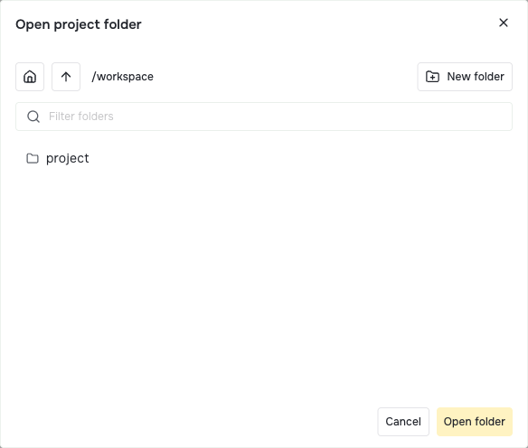
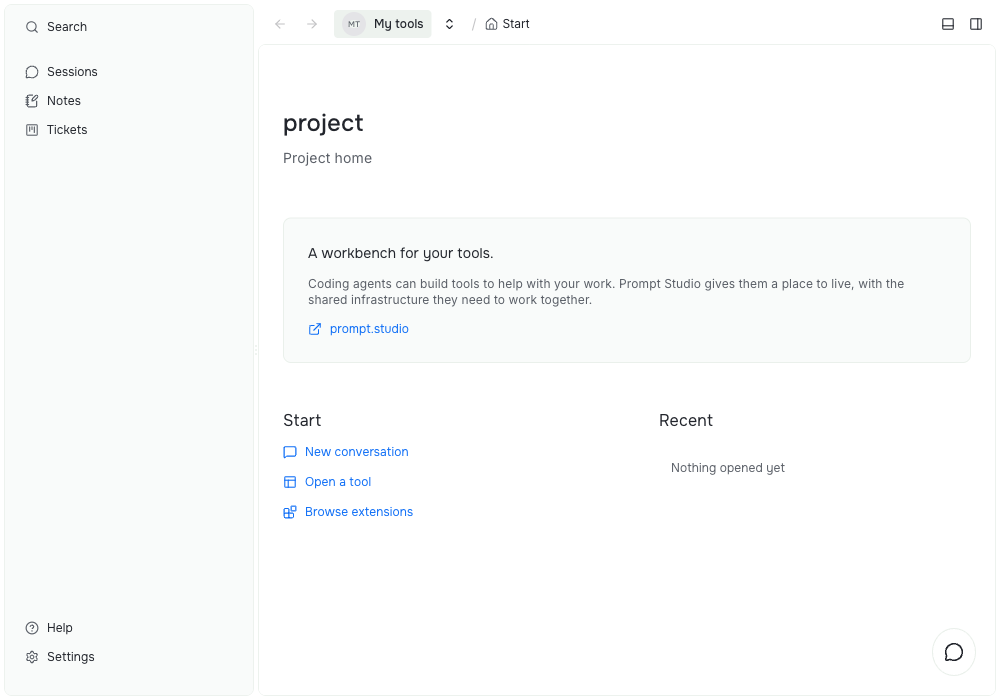

# Open a project

Open a folder to create a local project, or to return to one you already opened.

## Open a folder in the dashboard

1. Open the project menu from the arrow beside the project name at the top of the window. In the desktop app you can also choose **View → Open Project…**.
2. Choose **Create project**.
3. In **Open project folder**, browse to the folder, or type its path. Choose **New folder** to create an empty one.
4. Choose **Open folder**.

The folder does not need Git, and you do not need a coding agent installed yet. You can add both later.



The picker shows folders on the machine running Prompt Studio. The path in this example is `/workspace`; choose the folder where you want your own tools and files to live.

## Open a folder from the terminal

Run `pst projects create` inside the folder:

```sh
cd ~/my-tools
pst projects create
```

You can also pass a path and a name:

```sh
pst projects create "My tools" --path ~/my-tools
```

Other `pst` commands find the project from the folder you run them in. See [CLI projects](../../references/cli/0004-projects.md) for every option.

## What happens when you open a folder

- The folder name becomes the project name. You can rename the project in its settings.
- Prompt Studio writes `.pstdio/config.json` in the folder. This file links the folder to its project. A `.pstdio/.gitignore` keeps it out of Git.
- The project gets its default workspace: the folder itself. Agent sessions work in this folder and share its files.
- The default extensions are installed and turned on. They connect the Claude Code, Codex, and OpenCode agents, and add themes and skills.

Opening the same folder again reopens its project. A subfolder is a separate project, even inside a Git repository. Deleting a project keeps your chosen folder and your own files, but removes the project's matching `.pstdio/config.json` link and saved host data. Provider-created workspaces follow their provider's cleanup rules.

To learn how projects, workspaces, and Git worktrees fit together, read [Projects and workspaces](../concepts/0001-projects-and-workspaces.md).

## Find your way around the workbench

The workbench is the shared window where you use your tools and talk to agents. Start here after opening a project:



- The project name at the top takes you back to **Start**. Its arrow opens the project menu so you can switch projects.
- **New conversation** opens an agent conversation beside your current tool.
- **Open a tool** opens the command palette, where you can choose a tool or command. Enabled extensions can also add tools to the sidebar.
- **Browse extensions** opens the extension settings so you can add tools.
- **Settings** at the bottom of the sidebar holds runtime options, project options, and extension settings.

The example project has Notes and Planner enabled, so its sidebar includes **Notes** and **Tickets**. Those are extension tools. Your sidebar depends on the extensions you turn on.

Next, [add tools](0003-add-tools.md).
