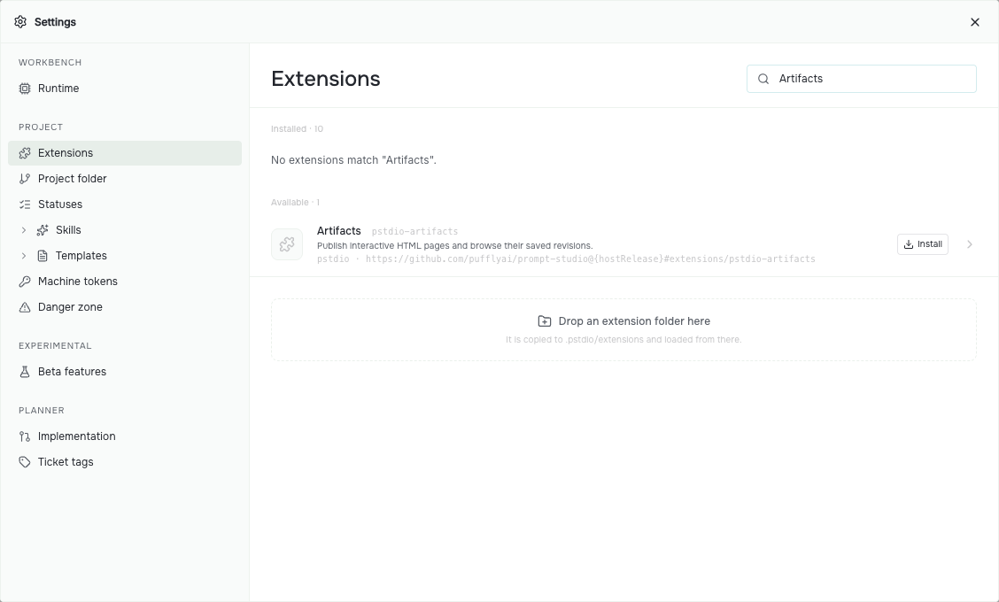
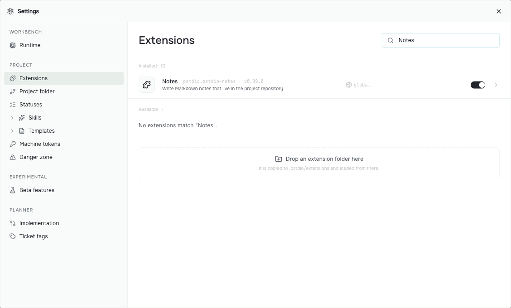

# Add tools

Tools come from extensions. Install an extension once, then turn it on in each project that should use it.

## First-party extensions

Prompt Studio publishes these tools as extensions. They use the public extension API and own their workflows and data. Install the ones you want:

| Extension | What it adds | Install name |
| --- | --- | --- |
| [Planner](../../../extensions/pstdio-planner/README.md) | Tickets, agent attempts, and reviews | `pstdio-planner` |
| [Notes](../../../extensions/pstdio-notes/README.md) | Markdown notes saved in the project folder | `pstdio-notes` |
| [Reports](../../../extensions/pstdio-reports/README.md) | Reports that agents hand to each other | `pstdio-reports` |
| [Artifacts](../../../extensions/pstdio-artifacts/README.md) | Interactive HTML pages with saved revisions | `pstdio-artifacts` |

New projects already have the agent harnesses, the base themes, and Prompt Studio Skills.

## Install from the dashboard

1. Choose **Browse extensions** on the project's Start page. You can also open **Settings** and choose **Extensions** under **Project**.
2. Find the extension under **Available**.
3. Choose **Install**.

The extension is installed and turned on for this project. Its tools appear in the sidebar, in menus, or in the command palette.



Use the search field to find a tool by name. **Available** lists extensions you can install; **Installed** lists those installed for the project or your user. This example shows Artifacts before installation. The list changes as you add extensions.

## Install from the terminal

Run `pst extensions add` with the install name, from inside the project folder:

```sh
pst extensions add pstdio-planner
```

The command installs the release that matches your Prompt Studio version and turns the extension on for the project. Run it outside a project folder to install without turning it on anywhere.

To install an extension from a folder on your computer, pass a path that starts with `./`, `../`, or `~/`, or an absolute path:

```sh
pst extensions add ./my-extension
```

## Turn extensions on and off

Each project has its own list in **Settings → Extensions**. Use the switch next to an extension to turn it on or off for that project. An extension installed for your user appears in every project. Other existing projects list it as off until you turn it on there. A project you create later starts with every installed extension turned on.

Settings and saved data belong to each project, so two projects can use the same extension in different ways.



The switch controls whether this project uses Notes. Turning it off removes its tools from this project's workbench. It does not uninstall the extension from your user.

## Try an installed tool

After installing Notes, choose **Notes** in the sidebar and create a note. Write a short heading and a list, then close and reopen the note to check that your work is saved. See [Write notes](../../../extensions/pstdio-notes/README.md#write-notes) for the editor and its controls.

Use the same check for a tool an agent builds: try its main action, change something, and reopen it. Tell the agent what happened if the result differs from your request.

## Use extension commands

Tools can expose their actions as CLI commands. That lets an agent use a tool directly, rather than navigate its screen. Run the commands inside your project folder so Prompt Studio uses that project's enabled extensions:

```sh
pst --help
pst pstdio-notes --help
pst pstdio-notes notes create --help
pst pstdio-notes notes create --title "Reading list"
```

With Notes installed and enabled, the last command creates the same empty note as **New note** in the sidebar. Open it in Notes to check the result. Planner adds shorter aliases such as `pst tickets list`; an extension's help shows its own paths and aliases.

For extension commands, `--json` returns the execution response, including its success or failure outcome. Agents can read that response and pass returned IDs to later commands. Use `--help` before guessing an action's flags.

When asking an agent to build a tool, ask for **CLI-ready actions** too: commands to inspect its state and perform its main operations, with useful help and results. This keeps the tool usable from its page, from a terminal, and by an agent. [Make actions CLI-ready](../extensions/0007-cli-ready-actions.md) explains the authoring pattern.

## Keep extensions up to date

When an installed first-party extension has a newer release for your Prompt Studio version, its row in **Settings → Extensions** shows **Upgrade**. From the terminal, run:

```sh
pst extensions update
```

## Ask an agent to build your tool

Start with one thing you want to make easier. You can describe the result without writing the extension code yourself. [Set up an agent and install its skills](0004-run-agents.md), then ask it to use the `create-pstdio-extension` skill. For example:

> Build a reading-list tool for this project. Use the create-pstdio-extension skill. I want to add a title and a link, mark an item as read, and keep the list after I close and reopen Prompt Studio. Put it in this project's sidebar. Make the actions CLI-ready: let me and my agents list items, add them, and mark them as read through pst commands. Install it in this project and show me how to use it.

The agent writes and installs an extension. Try adding an item, changing it, and reopening the tool. Ask for changes in the same conversation. A finished agent session is not proof that the tool works; check the result before relying on it.

Tools can work together when their authors expose commands, events, or resource references that another tool can use. Sharing the workbench does not automatically share all of their data.

If you want to write the code yourself, read [Write an extension](../extensions/0001-authoring.md). To learn how extensions load and run, read [Extensions](../concepts/0002-extensions.md).

Next, [run agents](0004-run-agents.md).
