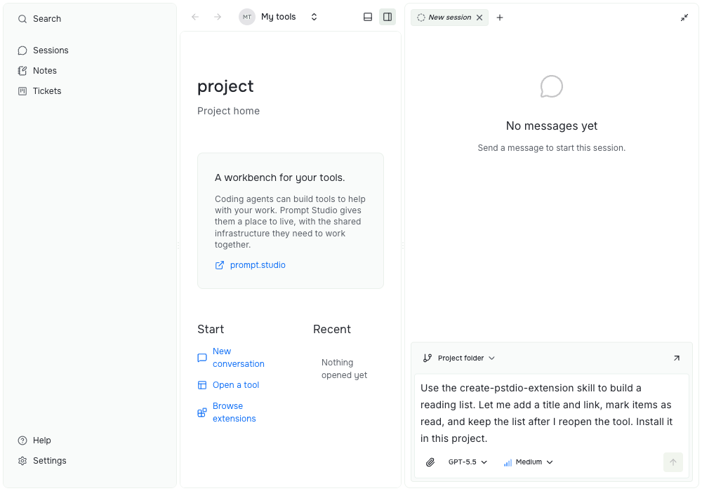
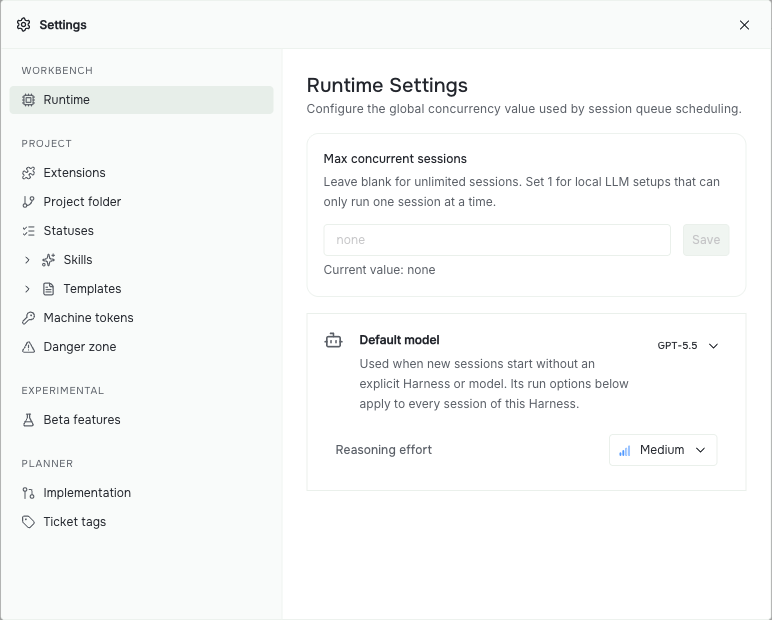

# Run agents

Prompt Studio runs coding agents that you install, such as Claude Code, Codex, and OpenCode. Install an agent, then start a session.

## Install an agent

Each new project has a harness extension for each supported agent. A harness connects Prompt Studio to the agent's own command-line tool. It does not install the agent or sign you in.

| Agent | Command Prompt Studio looks for | Harness docs |
| --- | --- | --- |
| Claude Code | `claude` | [Claude Code](../../../extensions/harness-claude-code/README.md) |
| Codex | `codex` | [Codex](../../../extensions/harness-codex/README.md) |
| OpenCode | `opencode` | [OpenCode](../../../extensions/harness-open-code/README.md) |

Install the agent and sign in as its own documentation describes. Then check what Prompt Studio finds:

```sh
pst agents list
```

The list shows each harness, its full ID, and whether its command is installed.

## Start a session

A session is one conversation with an agent. In the dashboard, choose **New conversation** on the project's Start page. Pick a harness and a model, type your request, and send it.



The conversation opens in a side panel so you can keep a tool visible while talking to the agent. The image shows a draft request before sending it. It asks for a small tool and describes what the person should be able to do with it.

Before sending:

1. Check the workspace selector above the message field. **Project folder** uses the project's own files; choose another ready workspace if you want the work elsewhere.
2. Use the model selector below the message field to choose the agent and model available on your machine. The pictured model is an example, not a requirement.
3. Describe the result you want and how you will check it. For a new tool, follow [Ask an agent to build your tool](0003-add-tools.md#ask-an-agent-to-build-your-tool), including skill setup.

From the terminal, run this inside the project folder:

```sh
pst sessions create --prompt "Summarize this folder" --agent pstdio.harness-claude-code.harness.claude-code
```

`--agent` takes the full harness ID that `pst agents list` shows. Leave it out to use the project's default.

Follow the session and continue it:

```sh
pst sessions list
pst sessions stream --id <session-id>
pst sessions follow-up --id <session-id> --prompt "Now add a README"
pst sessions stop --id <session-id>
```

When too many sessions run at once, new ones wait with the status `queued` and start in order. Set the limit in **Settings → Runtime → Max concurrent sessions**. Leave it blank for no limit.



Choose **Save** after changing the concurrency limit. This limit applies across projects. **Default model** sets the starting choice for new sessions in the current project; you can choose a different model in a session's composer.

## Answer approval requests

Some agents ask before they run a tool or change a file. The session shows the request, and you approve or deny it there. From the terminal, pass the session ID and the request ID:

```sh
pst sessions approve --id <session-id> --approval-id <approval-id>
pst sessions deny --id <session-id> --approval-id <approval-id>
```

## Choose where the agent works

Sessions run in the project folder by default, and they share its files. In a Git repository, you can give a session its own branch and folder instead. This is called a worktree workspace:

```sh
pst workspaces create --provider pstdio.worktree
pst sessions create --prompt "Try the refactor" --workspace-id <workspace-id>
```

Read [Projects and workspaces](../concepts/0001-projects-and-workspaces.md) to choose between them.

## Give the agent skills

Extensions can ship skills: instructions that teach an agent how to use a tool. Run this inside the project folder to install the skills of your enabled extensions for one agent:

```sh
pst agents setup claude-code
```

This copies the skills into the project folder, where the agent reads them. Add `--global-skills` to install them in the agent's global settings folder instead. Run it again after you turn on a new extension. For example, Planner adds skills for its ticket workflow, and Prompt Studio Skills adds a skill for writing extensions.

To learn what the host and the harness each do, read [Agents and harnesses](../concepts/0003-agents.md). For every session command, see [CLI sessions](../../references/cli/0006-sessions.md).

If an agent does not start, see [Troubleshooting](0005-troubleshooting.md).
