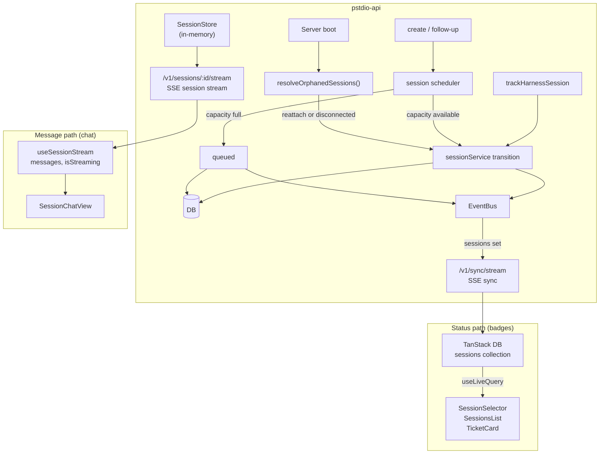

# Session Status Lifecycle

Session status has one authoritative path: DB → SSE sync → UI badges. The session stream is a separate concern that only carries messages.

## Architecture



### Status path — DB sync (badges)

Every session badge in the UI reads from the synced sessions collection:

1. Server mutates `sessions` table via `sessionService.transitionStatus()`.
2. That same domain-service operation emits the successful mutation.
3. SSE sync stream delivers `sync:set` event to all connected clients.
4. Client `sync-client.ts` writes to the TanStack DB `sessions` collection.
5. `useLiveQuery` re-renders badge components with the new status.

Components on this path: `TicketCard`, `SessionSelector`, `SessionsList`.

### Message path — session stream (chat)

The session chat view reads messages from a per-session SSE stream:

1. Client uses the SDK fetch-based SSE reader to `/v1/sessions/:id/stream`.
2. Server sends `patch` events (JSON patches for messages) and `approval_request` events.
3. `useSessionStream` hook maintains local state for messages and streaming indicator.

Components on this path: `SessionChatView` (messages and streaming indicator only).

`useSessionStream` does not expose session status. All visible status badges come from the DB sync path.

## Status transitions

```
create / follow-up ──► queued ──► in_progress
                           │          │
                           │          ├────────────┬────────────┬────────────┬────────────┐
                           │          ▼            ▼            ▼            ▼            ▼
                           │   awaiting_input  completed     failed      cancelled   disconnected
                           │          │                                                    │
                           │          ▼                                                    ▼
                           └──── in_progress (on approval)                         in_progress (on follow-up)
```

`disconnected` means the server lost the live process handle and could not reattach, or the provider reported a lost connection. A follow-up sent by the user starts a fresh resume and transitions the session back to `in_progress`.

Claude Code and Codex own their process lifecycle (`timeoutStrategy: "provider"`). The host waits for process exit and the message reader to finish. Quiet reasoning or tool execution does not impose a session time limit. Both harnesses drain stderr so diagnostics cannot fill a pipe and block the executable. User cancellation still calls the harness stop handler.

Harnesses that opt into the host activity watchdog, or omit a timeout strategy, are stopped and marked `failed` after ten minutes without message events. Message activity is not a reliable health check for the Claude Code or Codex executables.

`queued` means Prompt Studio accepted the prompt but has not started or resumed the agent runtime yet. A queued session has a persisted queue entry and moves to `in_progress` when the scheduler claims it and dispatch begins.

### Who writes status

| Trigger                | New status             | Code location                             |
| ---------------------- | ---------------------- | ----------------------------------------- |
| Session accepted at capacity | `queued`          | `createSessionScheduler`                  |
| Session created with capacity | `in_progress`    | `createSessionScheduler`                  |
| Follow-up sent with capacity | `in_progress`     | `createSessionScheduler`                  |
| Follow-up accepted at capacity | `queued`        | `createSessionScheduler`                  |
| Approval granted       | `in_progress`          | `approveSessionHandler`                   |
| Process exit code 0    | `completed`            | `trackHarnessSession`                        |
| Process exit code != 0 | `failed`               | `trackHarnessSession`                        |
| Host activity timeout (opt-in/default harnesses) | `failed` | `trackHarnessSession`                 |
| User stop              | `cancelled`            | `sessionService.cancel`                   |
| Stale recovery (reattach) | stays `in_progress` | `resolveOrphanedSessions` (startup sweep) |
| Stale recovery (no reattach) | `disconnected`   | `resolveOrphanedSessions` (startup sweep) |

### Multi-path status updates

Session status can change through multiple paths, but each transition must run one shared side-effect contract:

The session service owns these effects as one operation. Callers invoke its transition, resume, or queue method; they do not perform the steps separately.

1. Persist the new status in `sessions`.
2. Publish the successful change through the EventBus.
3. Fire the session lifecycle hook for that transition when `project_id` exists:
   - `onSessionStatusChanged` for status changes
   - `onSessionResumed` for resume transitions back to `in_progress`

Current paths that must follow this contract:

- `PATCH /v1/sessions/:id/status` (`updateSessionStatusHandler`)
- Agent process exit (`trackHarnessSession`)
- Startup orphan recovery (`resolveOrphanedSessions`)
- Session create spawn failure fallback (`createSessionHandler` catch path)
- Session scheduler transitions for create, follow-up, queue claim, and drain
- Approval transition `awaiting_input -> in_progress` (`approveSessionHandler`)

## Queue Recovery

The queue uses persisted `session_queue_entries` rows. On startup, queue recovery must run before orphaned `in_progress` recovery:

1. Pending entries whose sessions are still `queued` are loaded for draining.
2. Entries with `dispatch_started_at` but no in-memory runtime are reset to `queued`.
3. The scheduler drains while active capacity is available.
4. Only after queue recovery does orphan recovery inspect unrelated `in_progress` sessions.

This ordering prevents accepted queued work from being converted to `disconnected` after a crash between queue claim and runtime dispatch.

## Stale status recovery

### The problem

Event stores and process handles are **ephemeral** — they live in the `SessionStore` (an in-memory `Map`). When the server restarts:

1. All `SessionStore` entries are lost.
2. `trackHarnessSession` callbacks never fire for sessions that were running.
3. The DB retains `in_progress` for sessions whose agents already finished.
4. Badges on tickets stay stuck at `in_progress` permanently.

### The fix — startup sweep

On server boot, `resolveOrphanedSessions` runs as a startup task:

```
Server starts
     │
     ▼
Query all sessions with status "in_progress"
     │
     ▼
For each session:
  SessionStore has entry? ──yes──► Skip (legitimately running)
     │
     no (process handle lost)
     │
     ▼
  Harness supports reattach and advertises SessionReattach
  and session has agent_session_id?
     │
     ├── yes ──► harness.reattach() → re-subscribe to the agent's
     │            message stream; session stays "in_progress" and
     │            transitions naturally via trackHarnessSession.
     │
     ├── retryable setup failure ──► retry with backoff
     └── unsupported / permanent failure ──► "disconnected"
```

Retryable setup errors use exponential backoff from 250 milliseconds to a 30-second cap. Shutdown cancels the retry. A permanent failure transitions the same run to `disconnected`; an old recovery task cannot change a newer run.

Reattach is harness-specific. OpenCode supports it: its server is a long-lived process holding the canonical message history, so the host can resume polling. Claude Code does not expose reattach; a new follow-up resumes its saved session instead.

A session in `disconnected` can accept a follow-up. When the provider session remains available, the harness resumes it and the scheduler returns the session to `in_progress` when capacity permits.

### Structure

```
packages/pstdio-api/src/
  startup/
    index.ts              ← runStartupTasks(deps) — single entry point
  features/
    sessions/
      startup.ts          ← resolveOrphanedSessions(deps)
  app.ts                  ← calls runStartupTasks after deps are assembled
```

Each feature owns its startup logic. `createApp` makes one call. New tasks are one import + one line.

## Rules

- Use the session domain service's transition, resume, and queue operations for lifecycle changes. The service owns persistence, sync publication, and lifecycle hooks together.
- Do not add a DB update plus a separate EventBus emit in a route or harness adapter. That splits one transition across competing owners.
- Completion follows the harness result. UI heuristics and empty delivery buffers are not completion signals.
- Guard asynchronous cleanup and checkpoint writes by run identity so an old run cannot change a later follow-up.
- Keep queue acceptance, active capacity, and provider execution distinct. See [session queue](0018-architecture-session-queue.md) and [sessions](0020-architecture-sessions.md).
