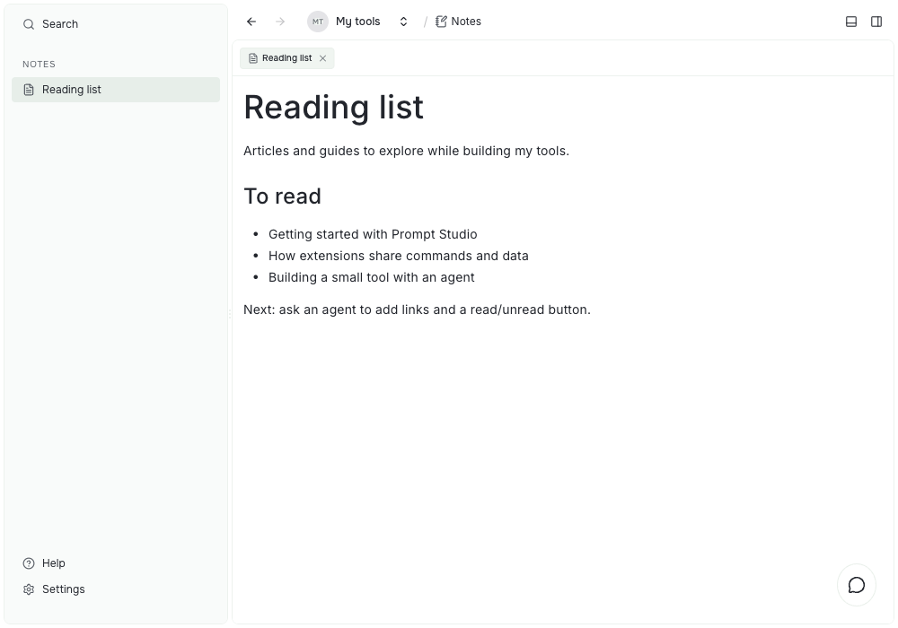

# Notes

Notes lets you write Markdown notes inside Prompt Studio and keeps them as files in your project's local default workspace.

## Install

Notes is not installed by default. Open **Settings → Project → Extensions**, find **Notes** under **Available**, and select **Install**. You can also run:

```sh
pst extensions add pstdio-notes
```

Install Notes once for your user, then turn it on in each project that should use it. Installing from a project turns it on there. Notes needs a ready local default workspace with file access; creating and editing notes needs write access.

## Write notes

Open **Notes** in the project sidebar to see the list of notes. Open a note to edit it in the Markdown editor. The editor shows headings, lists, links, tables, and code blocks as formatted text, and saves as you type.



The sidebar keeps your notes within reach while the open tab shows the note's body. This example is a Markdown note named **Reading list**, not a separate reading-list extension.

- Choose **New note** next to **Notes** to create a note. Give it a title. Its body starts empty.
- Selecting a note opens it in a tab and keeps the list of notes in the sidebar. Use the breadcrumb to go back to the project.
- A note's title is separate from its body. Editing or clearing the body keeps the title.
- Right-click a note and choose **Rename note** to change its title. The sidebar and open tabs update. The body stays the same.
- Right-click a note and choose **Delete** to delete it.
- Every note has its own ID, so two people can create notes with the same title at the same time.

For a first check, create a note, type a heading and a short list, then close its tab. Select the note again from the sidebar to see the saved text. You can keep the note open beside an agent conversation while you describe the tool you want to build.

Agents can manage notes too:

```sh
pst pstdio-notes notes create --title "Meeting notes"
pst pstdio-notes notes rename --note-id <note-id> --title "New title"
pst pstdio-notes notes delete --note-id <note-id>
```

## Where notes are stored

Each note is a folder in the project's default workspace. The title and the Markdown body are separate files:

```txt
<project-folder>/.pstdio/extension-storage/pstdio-notes/documents/<note-id>/
  title.txt
  content.md
```

Git is optional. In a Git project, commit that folder to share notes with your team, or leave it out of Git to keep them on your computer.
